# Cost Aware RAG Agent

<div align="center">

**An intelligent RAG system that automatically balances answer quality with API costs**

[](https://www.python.org/)
[](https://github.com/langchain-ai/langgraph)
[](https://openai.com/)

</div>

---

## 🎯 Overview

The **Cost Aware RAG Agent** is an intelligent system that dynamically routes queries between cost efficient and high quality language models based on query complexity. It uses a sophisticated validation pipeline to ensure answer quality while minimizing API costs.

### ✨ Key Features

- 🎯 **Smart Query Routing** - Automatically determines optimal model based on query complexity
- 💰 **Cost Optimization** - Routes simple queries to cheaper models complex ones to premium models
- 🔄 **Adaptive Retry Logic** - Falls back to expensive models if cheap model answers are inadequate
- ✅ **Answer Validation** - Validates answer quality before returning to user
- 📊 **Cost Tracking** - Estimates and tracks API costs for each query
- 🔀 **LangGraph Integration** - Built on LangGraph for robust workflow orchestration

---

## 🏗️ Architecture

### System Flow Diagram

```mermaid
graph TD
    A[👤 User Query] --> B[💰 Cost Estimator]
    B --> C{🔀 Router}
    C -->|Low Cost<br/>≤ $0.005| D[🚀 Cheap RAG<br/>gpt-4o-mini]
    C -->|High Cost<br/>> $0.005| E[⭐ Expensive RAG<br/>gpt-4o]
    D --> F[✅ Validator]
    E --> F
    F -->|Confidence ≥ 0.75| G[✓ Accept Answer]
    F -->|Confidence < 0.75<br/>retries < 1| E
    F -->|Retries Exhausted| G
    G --> H[📤 Final Response]
    
    style A fill:#e1f5ff
    style B fill:#fff4e6
    style C fill:#f3e5f5
    style D fill:#e8f5e9
    style E fill:#fce4ec
    style F fill:#fff9c4
    style G fill:#c8e6c9
    style H fill:#b2ebf2
```



### State Machine Flow


---

## 📁 Project Structure

```
cost-aware-rag-agent/
│
├── 📄 main.py                      # Entry point - runs the agent
├── 📄 requirements.txt             # Python dependencies
├── 📄 cost_aware_rag_agent.txt    # Simple flow diagram
│
├── 📂 graph/                       # LangGraph workflow orchestration
│   ├── graph.py                    # Main graph builder & node wiring
│   ├── state.py                    # State schema (TypedDict)
│   │
│   └── 📂 nodes/                   # Individual graph nodes
│       ├── cost_estimator.py      # Estimates query cost heuristically
│       ├── router.py              # Routes to cheap/expensive model
│       ├── cheap_rag.py           # Cheap model RAG (gpt-4o-mini)
│       ├── expensive_rag.py       # Expensive model RAG (gpt-4o)
│       └── validator.py           # Validates answer quality
│
├── 📂 llm/                         # LLM client abstraction
│   └── client.py                  # OpenAI client wrapper
│
├── 📂 rag/                         # RAG retrieval logic
│   └── retriever.py               # Mock context retriever
│
└── 📂 utils/                       # Shared utilities
    └── scoring.py                 # Validation router & scoring logic
```

---

## 🔧 Component Details

### 1️⃣ **Cost Estimator Node**

**Purpose:** Analyzes query complexity to estimate API costs before processing.

**Logic:**
- Base cost: `$0.002`
- Long queries (>120 chars): `+$0.04`
- Complex keywords detected: `+$0.01`

**Keywords Analyzed:**
```python
["compare", "analyze", "why", "tradeoff", "architecture"]
```

**Example:**
```python
# Simple query
"What is Redis?" → $0.002

# Complex query  
"Compare Redis vs PostgreSQL for vector search" → $0.012
```

---

### 2️⃣ **Router Node**

**Purpose:** Routes queries to appropriate model tier based on cost estimate.

**Decision Logic:**
```python
if estimated_cost <= $0.005:
    route = "cheap"    # gpt-4o-mini
else:
    route = "expensive" # gpt-4o
```

**Routing Table:**

| Estimated Cost | Model | Use Case |
|---------------|-------|----------|
| ≤ $0.005 | `gpt-4o-mini` | Simple lookups, factual queries |
| > $0.005 | `gpt-4o` | Complex reasoning, comparisons, analysis |

---

### 3️⃣ **RAG Nodes**

#### Cheap RAG Node (`gpt-4o-mini`)

**Purpose:** Fast, cost-efficient answers for simple queries.

**Prompt Strategy:** Concise, context-focused
```python
"""
Answer using the context below concisely.

Context: 
{retrieved_context}

Question: 
{query}
"""
```

**Cost:** ~$0.001 - $0.003 per call

---

#### Expensive RAG Node (`gpt-4o`)

**Purpose:** High-quality, detailed answers for complex queries.

**Prompt Strategy:** Detailed, reasoning-focused
```python
"""
Provide a detailed, well-reasoned answer using the context.

Context:
{retrieved_context}

Question:
{query}
"""
```

**Cost:** ~$0.01 - $0.05 per call

---

### 4️⃣ **Validator Node**

**Purpose:** Ensures answer quality meets acceptable thresholds.

**Validation Process:**


**Scoring Criteria:**
- ✅ Correctness
- ✅ Completeness  
- ✅ Clarity

**Confidence Threshold:** `0.75`

---

### 5️⃣ **Validation Router**

**Purpose:** Centralized decision logic for retry/accept after validation.

**Decision Tree:**

```python
def validation_router(state):
    # ✅ Case 1: High confidence → Accept
    if confidence >= 0.75:
        return "end"
    
    # 🔄 Case 2: Cheap failed → Retry expensive
    if route == "cheap" and retries < 1:
        return "expensive"
    
    # ⚠️ Case 3: Exhausted retries → Accept best
    return "end"
```

---

## 🚀 Getting Started

### Prerequisites

- Python 3.9+
- OpenAI API Key

### Installation

1. **Clone the repository:**
```bash
git clone <repository-url>
cd cost-aware-rag-agent
```

2. **Install dependencies:**
```bash
pip install -r requirements.txt
```

3. **Set up environment variables:**
```bash
# Create .env file
echo "OPENAI_API_KEY=your_api_key_here" > .env
```

### Running the Agent

```bash
python main.py
```

**Example Output:**
```
=== FINAL ANSWER ===

Redis and PostgreSQL both support vector search but with different approaches:

Redis offers vector similarity search through RedisSearch module with:
- In-memory performance for ultra-low latency
- HNSW and Flat indexing algorithms
- Best for real-time applications requiring <10ms response times

PostgreSQL provides vector search via pgvector extension with:
- Persistent storage with ACID guarantees
- Integration with relational data
- Better for applications needing complex joins with vector data

Tradeoff: Redis wins on speed, PostgreSQL wins on data integrity and complex queries.

Confidence: 0.87
Estimated cost: 0.012
```

---

## 🔄 Execution Flow Examples

### Example 1: Simple Query (Cheap Model Sufficient)


---

### Example 2: Complex Query (Automatic Escalation)


---

### Example 3: Direct to Expensive Model


---

## 📊 State Management

The system uses a **TypedDict** to maintain state across nodes:

```python
class RAGState(TypedDict):
    query: str                    # User's input query
    estimated_cost: float         # Predicted API cost
    route: Literal["cheap", "expensive"]  # Selected route
    retrieved_context: str        # RAG context from retriever
    answer: str                   # Generated answer
    confidence: float             # Answer quality score (0-1)
    retries: int                  # Retry attempt counter
    final_answer: str             # Validated final answer
```

**State Evolution Example:**

```python
# Initial State
{
    "query": "Compare Redis vs PostgreSQL",
    "retries": 0
}

# After Cost Estimator
{
    "query": "Compare Redis vs PostgreSQL",
    "estimated_cost": 0.012,
    "retries": 0
}

# After Router
{
    "query": "Compare Redis vs PostgreSQL",
    "estimated_cost": 0.012,
    "route": "cheap",
    "retries": 0
}

# After Cheap RAG
{
    "query": "Compare Redis vs PostgreSQL",
    "estimated_cost": 0.012,
    "route": "cheap",
    "retrieved_context": "...",
    "answer": "Redis is faster...",
    "retries": 0
}

# After Validator (low confidence)
{
    "query": "Compare Redis vs PostgreSQL",
    "estimated_cost": 0.012,
    "route": "expensive",  # Updated for retry
    "retrieved_context": "...",
    "answer": "Redis is faster...",
    "confidence": 0.65,
    "retries": 1  # Incremented
}

# After Expensive RAG (retry)
{
    "query": "Compare Redis vs PostgreSQL",
    "estimated_cost": 0.012,
    "route": "expensive",
    "retrieved_context": "...",
    "answer": "Detailed comparison...",
    "confidence": 0.87,
    "retries": 1,
    "final_answer": "Detailed comparison..."
}
```

---

## ⚙️ Configuration

### Tunable Parameters

| Parameter | Location | Default | Description |
|-----------|----------|---------|-------------|
| `MAX_CHEAP_COST` | `graph/nodes/router.py` | `$0.005` | Cost threshold for routing |
| `CONFIDENCE_THRESHOLD` | `utils/scoring.py` | `0.75` | Minimum acceptable confidence |
| `MAX_RETRIES` | `utils/scoring.py` | `1` | Maximum retry attempts |
| `COMPLEX_KEYWORDS` | `graph/nodes/cost_estimator.py` | `["compare", "analyze", ...]` | Keywords indicating complexity |

### Customization Examples

**Increase cost threshold (use cheap model more often):**
```python
# graph/nodes/router.py
MAX_CHEAP_COST = 0.010  # Was 0.005
```

**Stricter validation:**
```python
# utils/scoring.py
CONFIDENCE_THRESHOLD = 0.85  # Was 0.75
```

**More retry attempts:**
```python
# utils/scoring.py
MAX_RETRIES = 2  # Was 1
```

---

## 🧪 Testing & Extending

### Adding New Cost Factors

Extend the cost estimator with custom heuristics:

```python
# graph/nodes/cost_estimator.py
def cost_estimator_node(state):
    q = state["query"].lower()
    cost = 0.002
    
    # Existing logic...
    
    # 🆕 Add domain-specific cost factors
    if "machine learning" in q or "deep learning" in q:
        cost += 0.015  # ML queries need more reasoning
    
    if q.count("?") > 2:
        cost += 0.005  # Multi-part questions
    
    state["estimated_cost"] = cost
    return state
```

### Replacing Mock Retriever

Integrate real vector database:

```python
# rag/retriever.py
from pinecone import Pinecone

def retrieve_context(query: str) -> str:
    # Initialize Pinecone
    pc = Pinecone(api_key="your-api-key")
    index = pc.Index("your-index")
    
    # Get embeddings and search
    embedding = get_embedding(query)
    results = index.query(vector=embedding, top_k=5)
    
    # Format context
    context = "\n".join([r.metadata['text'] for r in results])
    return context
```

### Adding Observability

Track costs and performance:

```python
# utils/scoring.py
import logging

logger = logging.getLogger(__name__)

def validation_router(state: RAGState):
    logger.info(f"Query: {state['query']}")
    logger.info(f"Route: {state['route']}")
    logger.info(f"Confidence: {state.get('confidence', 0)}")
    logger.info(f"Estimated Cost: {state['estimated_cost']}")
    
    # Existing logic...
```

---

## 💡 Use Cases

### 1. Customer Support Chatbots
- Simple FAQ queries → Cheap model
- Complex troubleshooting → Expensive model
- **Savings:** 60-70% API cost reduction

### 2. Research Assistants
- Basic fact lookup → Cheap model
- Deep analysis & synthesis → Expensive model
- **Savings:** 40-50% with maintained quality

### 3. Code Documentation
- Simple "what is X?" → Cheap model
- Architecture explanations → Expensive model
- **Savings:** 50-60% on routine queries

### 4. Educational Platforms
- Definition requests → Cheap model
- Essay feedback & detailed explanations → Expensive model
- **Savings:** 55-65% while preserving learning quality

---

## 📈 Performance Characteristics

### Cost Savings Analysis


**Typical Savings:** 40-60% compared to always using expensive models

### Latency Comparison

| Scenario | Latency | Cost |
|----------|---------|------|
| Simple + Cheap | ~1-2s | $0.002-0.005 |
| Complex + Cheap → Expensive | ~3-5s | $0.010-0.020 |
| Complex + Direct Expensive | ~2-3s | $0.015-0.050 |

---

## 🛠️ Advanced Features

### Conditional Edge Logic

The system uses LangGraph's powerful conditional edges:

```python
# graph/graph.py
g.add_conditional_edges(
    "validate",
    validation_router,  # Custom routing function
    {
        "expensive": "expensive",  # Retry path
        "end": END                 # Success path
    }
)
```

### State Mutation Safety

The validation router safely mutates state for retries:

```python
# utils/scoring.py
def validation_router(state: RAGState):
    if should_retry(state):
        state["route"] = "expensive"  # Safe mutation
        state["retries"] = state.get("retries", 0) + 1
        return "expensive"
    return "end"
```

---

## 🔐 Security & Best Practices

### Environment Variables

✅ **DO:**
```python
# Use environment variables for API keys
api_key = os.getenv("OPENAI_API_KEY")
```

❌ **DON'T:**
```python
# Never hardcode API keys
api_key = "sk-..."  # Bad!
```

### Error Handling

The system includes graceful fallbacks:

```python
# graph/nodes/validator.py
try:
    state["confidence"] = float(score)
except:
    state["confidence"] = 0.0  # Safe default
```

### Cost Controls

Implement budget limits:

```python
# Example extension
MAX_DAILY_COST = 10.00
if total_cost > MAX_DAILY_COST:
    raise BudgetExceededError("Daily budget reached")
```

---

## 🐛 Troubleshooting

### Common Issues

#### 1. Low Confidence Scores Always Triggering Retries

**Symptom:** Every query goes through expensive retry

**Solution:** Adjust confidence threshold or improve validation prompt

```python
# utils/scoring.py
CONFIDENCE_THRESHOLD = 0.70  # Lower threshold
```

#### 2. All Queries Routed to Expensive Model

**Symptom:** Cost estimator too aggressive

**Solution:** Increase MAX_CHEAP_COST or adjust cost factors

```python
# graph/nodes/router.py
MAX_CHEAP_COST = 0.010  # Increase threshold
```

#### 3. Mock Retriever Returning Generic Context

**Symptom:** Answers lack specificity

**Solution:** Replace with real vector database (see "Extending" section)

---

## 📚 References & Resources

### LangGraph Documentation
- [LangGraph Official Docs](https://langchain-ai.github.io/langgraph/)
- [StateGraph Guide](https://langchain-ai.github.io/langgraph/concepts/low_level/)

### RAG Resources
- [RAG Best Practices](https://www.pinecone.io/learn/retrieval-augmented-generation/)
- [Vector Database Comparison](https://www.pinecone.io/learn/vector-database/)

### Cost Optimization
- [OpenAI Pricing](https://openai.com/pricing)
- [Token Optimization Guide](https://platform.openai.com/docs/guides/prompt-engineering)
