# 🎫 Customer Support Ticket System

> An intelligent, AI-powered customer support system that automatically classifies, routes and resolves support tickets using multiple specialized agents built with LangGraph.

[](https://www.python.org/downloads/)
[](https://github.com/langchain-ai/langgraph)
[](https://openai.com/)

---

## 📋 Table of Contents

- [Overview](#overview)
- [Key Features](#key-features)
- [System Architecture](#system-architecture)
- [Project Structure](#project-structure)
- [Agent Flow Diagram](#agent-flow-diagram)
- [Installation](#installation)
- [Quick Start](#quick-start)
- [Detailed Component Guide](#detailed-component-guide)
- [Configuration](#configuration)
- [How It Works](#how-it-works)
- [Examples](#examples)
- [Contributing](#contributing)

---

## 🌟 Overview

This system is a **production ready multi agent orchestration framework** designed for automated customer support ticket handling. It demonstrates advanced AI concepts including:

- **Multi Agent Orchestration** - Specialized agents working together
- **LLM Powered Routing** - Intelligent ticket classification
- **Conditional Branching** - Dynamic workflow paths based on confidence
- **Human in the Loop** - Escalation for complex cases
- **State Persistence** - Ticket history across multiple interactions
- **Confidence-Based Escalation** - Quality assurance through uncertainty detection

---

## ✨ Key Features

| Feature                           | Description                                                          |
| --------------------------------- | -------------------------------------------------------------------- |
| 🤖 **Intelligent Classification** | AI-powered categorization into Technical, Billing or General support |
| 🎯 **Specialized Agents**         | Domain specific agents for targeted problem resolution               |
| 📊 **Confidence Scoring**         | Built in uncertainty detection for quality control                   |
| 👤 **Human Review**               | Automatic escalation for low confidence or complex cases             |
| 💾 **Persistent Memory**          | Maintains conversation history across multiple messages              |
| 🔄 **Conditional Routing**        | Smart workflow branching based on ticket properties                  |
| ⚡ **Real-time Processing**       | Instant ticket classification and response generation                |

---

## 🏗️ System Architecture

```mermaid
graph TB
    Start([User Submits Ticket]) --> Save[Save to Memory Store]
    Save --> Classifier[🤖 Classifier Agent]
    Classifier --> Confidence{Confidence Check<br/>threshold: 0.75}

    Confidence -->|≥ 0.75| Category{Category?}
    Confidence -->|< 0.75| Human[👤 Human Review Agent]

    Category -->|technical| Tech[🔧 Technical Support Agent]
    Category -->|billing| Billing[💳 Billing Support Agent]
    Category -->|general| General[📝 General Support Agent]

    Tech --> Response1[Generate Response]
    Billing --> Response2[Generate Response]
    General --> Response3[Generate Response]
    Human --> Escalate[Mark as Escalated]

    Response1 --> End([Return to User])
    Response2 --> End
    Response3 --> End
    Escalate --> End

    style Classifier fill:#e1f5ff,stroke:#01579b,stroke-width:3px
    style Tech fill:#c8e6c9,stroke:#2e7d32,stroke-width:2px
    style Billing fill:#fff9c4,stroke:#f57f17,stroke-width:2px
    style General fill:#f3e5f5,stroke:#6a1b9a,stroke-width:2px
    style Human fill:#ffccbc,stroke:#d84315,stroke-width:3px
    style Confidence fill:#fff3e0,stroke:#e65100,stroke-width:2px
```



---

## 📁 Project Structure

```
Multi_Agent_Research_System/
│
├── 📄 main.py                          # Entry point - orchestrates the entire flow
├── 📄 requirements.txt                 # Python dependencies
├── 📄 customer_support_ticket_agent.txt # System documentation
│
├── 📁 graph/                           # Core workflow orchestration
│   ├── graph.py                        # LangGraph workflow builder
│   ├── state.py                        # Shared state schema (TypedDict)
│   │
│   └── 📁 agents/                      # All agent implementations
│       ├── classifier_agent.py         # Ticket classification + confidence scoring
│       ├── tech_agent.py               # Technical support specialist
│       ├── billing_agent.py            # Billing support specialist
│       ├── general_agent.py            # General inquiry handler
│       ├── human_review_agent.py       # Human escalation handler
│       └── routing_logic.py            # Confidence-based routing logic
│
├── 📁 llm/                             # LLM integration layer
│   └── client.py                       # OpenAI API client wrapper
│
└── 📁 memory/                          # Persistence layer
    └── store.py                        # In-memory ticket history store
```

---

## 🔄 Agent Flow Diagram


---

## 🚀 Installation

### Prerequisites

- Python 3.8 or higher
- OpenAI API key
- pip package manager

### Setup Instructions

1. **Clone the repository**

   ```bash
   git clone https://github.com/aaryan182/ai_agents_prod_langgraph.git
   cd Customer_support_Ticket_agent
   ```

2. **Create a virtual environment** (recommended)

   ```bash
   python -m venv venv
   source venv/bin/activate  # On Windows: venv\Scripts\activate
   ```

3. **Install dependencies**

   ```bash
   pip install -r requirements.txt
   ```

4. **Set up environment variables**

   ```bash
   export OPENAI_API_KEY='your-api-key-here'
   ```

   Or create a `.env` file:

   ```env
   OPENAI_API_KEY=your-api-key-here
   ```

### Required Dependencies

```txt
langgraph>=0.0.1
openai>=1.0.0
python-dotenv>=1.0.0
```

---

## ⚡ Quick Start

### Basic Usage

```python
from graph.graph import build_graph
from memory.store import save_ticket_message

# Initialize the agent
agent = build_graph()

# Create a ticket
ticket_id = "TICKET-001"
message = "My payment failed but money was deducted"

# Save to history
save_ticket_message(ticket_id, message)

# Process the ticket
result = agent.invoke({
    "ticket_id": ticket_id,
    "message": message,
    "resolved": False,
    "escalated": False
})

# Get the response
print(result["response"])
```

### Running the Demo

```bash
python main.py
```

**Expected Output:**

```
=== SUPPORT RESPONSE ===

I understand your concern about the failed payment with money deducted.
Let me help you resolve this billing issue...
[AI-generated response]
```

---

## 📚 Detailed Component Guide

### 1. State Management (`graph/state.py`)

The `TicketState` is the backbone of the entire system, shared across all agents:

```python
class TicketState(TypedDict):
    ticket_id: str      # Unique identifier for the ticket
    message: str        # Current user message
    category: str       # Classified category (technical/billing/general)
    confidence: float   # Confidence score from classifier (0-1)
    history: List[str]  # Previous messages in conversation
    response: str       # Agent's response to user
    resolved: bool      # Whether ticket is resolved
    escalated: bool     # Whether ticket requires human review
```

**Key Points:**

- **Immutable Schema**: TypedDict ensures type safety
- **Shared State**: Passed between all agents in the workflow
- **History Tracking**: Enables context-aware responses

---

### 2. LLM Client (`llm/client.py`)

Simple abstraction over OpenAI API:

```python
from openai import OpenAI
client = OpenAI()

def call_llm(prompt: str, model='gpt-4.1'):
    res = client.chat.completions.create(
        model=model,
        messages=[{"role": "user", "content": prompt}]
    )
    return res.choices[0].message.content
```

**Features:**

- Configurable model selection
- Single responsibility: LLM communication
- Easy to extend for other providers (Anthropic, Cohere, etc.)

---

### 3. Memory Store (`memory/store.py`)

In-memory ticket history management:

```python
_ticket_db = {}  # In-memory storage

def get_ticket_history(ticket_id: str):
    """Retrieve all messages for a ticket"""
    return _ticket_db.get(ticket_id, [])

def save_ticket_message(ticket_id: str, message: str):
    """Append new message to ticket history"""
    history = _ticket_db.get(ticket_id, [])
    history.append(message)
    _ticket_db[ticket_id] = history
```

**Production Alternatives:**

- Replace with **Redis** for distributed systems
- Use **PostgreSQL** with JSONB for persistence
- Integrate **MongoDB** for document-based storage

---

### 4. Classifier Agent (`graph/agents/classifier_agent.py`)

The brain of the routing system:


**Code Flow:**

```python
def classifier_agent(state: TicketState):
    # 1. Retrieve conversation history
    history = get_ticket_history(state["ticket_id"])

    # 2. Build classification prompt
    prompt = f"""
    Classify the support ticket into one category:
    - technical
    - billing
    - general

    Also provide confidence score(0-1).

    Ticket history: {history}
    Current message: {state['message']}

    Return JSON: {{"category": "...", "confidence": 0.0}}
    """

    # 3. Get LLM classification
    response = call_llm(prompt)

    # 4. Parse and validate
    result = json.loads(response)

    # 5. Update state
    state['category'] = result.get('category')
    state['confidence'] = result.get('confidence')

    return state
```

**Output Example:**

```json
{
  "category": "billing",
  "confidence": 0.92
}
```

---

### 5. Routing Logic (`graph/agents/routing_logic.py`)

Confidence-based decision making:

```python
CONFIDENCE_THRESHOLD = 0.75

def route_ticket(state):
    """Route based on confidence score"""
    if state["confidence"] < CONFIDENCE_THRESHOLD:
        return "human"  # Escalate low-confidence tickets

    return state["category"]  # Route to specialized agent
```

**Decision Tree:**


---

### 6. Specialized Agents

#### Technical Support Agent (`tech_agent.py`)

```python
def tech_agent(state):
    prompt = f"""
    You are a technical support agent.
    Solve this issue clearly.

    Issue: {state['message']}
    """
    state['response'] = call_llm(prompt)
    state['resolved'] = True
    return state
```

**Handles:**

- Login issues
- Software bugs
- System errors
- Technical troubleshooting

#### Billing Support Agent (`billing_agent.py`)

```python
def billing_agent(state):
    prompt = f"""
    You are a billing support agent.
    Issue: {state['message']}
    """
    state['response'] = call_llm(prompt)
    state['resolved'] = True
    return state
```

**Handles:**

- Payment failures
- Refund requests
- Subscription issues
- Invoice queries

#### General Support Agent (`general_agent.py`)

```python
def general_agent(state):
    prompt = f"""
    You are a customer support agent.
    Issue: {state['message']}
    """
    state['response'] = call_llm(prompt)
    state['resolved'] = True
    return state
```

**Handles:**

- Product inquiries
- General questions
- Account information
- Miscellaneous requests

---

### 7. Human Review Agent (`human_review_agent.py`)

```python
def human_review_agent(state):
    state["response"] = (
        "This ticket requires human review. "
        "A support representative will contact you shortly."
    )
    state["escalated"] = True
    return state
```

**Triggered When:**

- Confidence < 0.75
- Ambiguous requests
- Complex edge cases
- Multi-category issues

---

### 8. Graph Builder (`graph/graph.py`)

The orchestration layer using LangGraph:

```python
from langgraph.graph import StateGraph, END

def build_graph():
    g = StateGraph(TicketState)

    # Add all agent nodes
    g.add_node("classify", classifier_agent)
    g.add_node("technical", tech_agent)
    g.add_node("billing", billing_agent)
    g.add_node("general", general_agent)
    g.add_node("human", human_review_agent)

    # Set entry point
    g.set_entry_point("classify")

    # Add conditional routing from classifier
    g.add_conditional_edges(
        "classify",
        route_ticket,
        {
            "technical": "technical",
            "billing": "billing",
            "general": "general",
            "human": "human"
        }
    )

    # All agents end the workflow
    g.add_edge("technical", END)
    g.add_edge("billing", END)
    g.add_edge("general", END)
    g.add_edge("human", END)

    return g.compile()
```

---

## 🔧 Configuration

### Adjusting Confidence Threshold

Edit `graph/agents/routing_logic.py`:

```python
# Lower threshold = more tickets to specialists (faster, risk of misclassification)
CONFIDENCE_THRESHOLD = 0.60

# Higher threshold = more tickets to humans (safer, slower)
CONFIDENCE_THRESHOLD = 0.85
```

**Recommended Values:**

- **Production**: 0.75-0.80
- **Development**: 0.60-0.70
- **High-risk domains**: 0.85-0.90

### Changing LLM Model

Edit `llm/client.py`:

```python
def call_llm(prompt: str, model='gpt-4o'):  # Use GPT-4 Turbo
    # ... rest of code
```

**Model Options:**

- `gpt-4o` - Fast and capable
- `gpt-4-turbo` - Latest GPT-4
- `gpt-3.5-turbo` - Cost-effective

---

## 🎯 How It Works

### Complete Flow Example

Let's trace a ticket through the system:

**User Input:**

```
"My payment failed but money was deducted from my account"
```

**Step-by-Step Execution:**

1. **Main Entry** (`main.py`)

   ```python
   ticket_id = "TICKET-001"
   save_ticket_message(ticket_id, message)  # Save to memory
   result = agent.invoke({...})
   ```

2. **Classifier Agent** processes the ticket

   - Fetches history: `[]` (new ticket)
   - Builds prompt with ticket content
   - LLM returns: `{"category": "billing", "confidence": 0.92}`
   - Updates state

3. **Routing Logic** evaluates confidence

   - Checks: `0.92 >= 0.75` ✅
   - Routes to: `billing` agent

4. **Billing Agent** generates response

   - Creates specialized prompt
   - LLM generates billing-focused response
   - Marks ticket as resolved

5. **Return to User**

   ```
   === SUPPORT RESPONSE ===

   I sincerely apologize for the inconvenience...
   [Detailed billing resolution]
   ```

---

## 💡 Examples

### Example 1: Technical Issue (High Confidence)

**Input:**

```python
message = "I can't login to my account. Getting 'Invalid credentials' error"
```

**Flow:**

```
Classifier → confidence: 0.89 → Technical Agent → Resolved
```

**Output:**

```
Let me help you resolve this login issue:

1. Reset your password using the "Forgot Password" link
2. Clear your browser cache and cookies
3. Try logging in with a different browser
...
```

---

### Example 2: Ambiguous Request (Low Confidence)

**Input:**

```python
message = "I need help with something urgent"
```

**Flow:**

```
Classifier → confidence: 0.42 → Human Review Agent → Escalated
```

**Output:**

```
This ticket requires human review.
A support representative will contact you shortly.
```

---

### Example 3: Multi-Turn Conversation

**Turn 1:**

```python
message = "How do I upgrade my plan?"
# Response: General agent provides upgrade instructions
```

**Turn 2:**

```python
message = "The upgrade button doesn't work"
# Response: Technical agent troubleshoots UI issue
# History context helps identify it's related to previous upgrade question
```

---

## 🚦 Advanced Usage

### Adding a New Agent Category

1. **Create agent file**: `graph/agents/refund_agent.py`

   ```python
   def refund_agent(state):
       prompt = f"You are a refund specialist. {state['message']}"
       state['response'] = call_llm(prompt)
       state['resolved'] = True
       return state
   ```

2. **Update classifier prompt**: Add "refund" category

3. **Register in graph builder**:
   ```python
   g.add_node("refund", refund_agent)
   g.add_conditional_edges("classify", route_ticket, {
       ...,
       "refund": "refund"
   })
   g.add_edge("refund", END)
   ```

### Integrating with Real Database

Replace `memory/store.py`:

```python
import redis

r = redis.Redis(host='localhost', port=6379, decode_responses=True)

def get_ticket_history(ticket_id: str):
    history = r.lrange(f"ticket:{ticket_id}", 0, -1)
    return history

def save_ticket_message(ticket_id: str, message: str):
    r.rpush(f"ticket:{ticket_id}", message)
```

---

## 📊 Performance & Metrics

### Latency Breakdown

| Component      | Average Time | Optimization         |
| -------------- | ------------ | -------------------- |
| Memory Fetch   | ~5ms         | Use Redis caching    |
| Classifier LLM | ~2-3s        | Use faster model     |
| Specialist LLM | ~2-4s        | Response streaming   |
| **Total**      | **~4-7s**    | Acceptable for async |

### Cost Analysis (GPT-4)

- Classifier: ~500 tokens = **$0.015** per ticket
- Specialist: ~800 tokens = **$0.024** per ticket
- **Total**: ~**$0.04 per ticket**

**Cost Reduction:**

- Use GPT-3.5 for classification (-70%)
- Cache common responses
- Implement rate limiting

---

## 🧪 Testing

### Unit Tests

```python
import pytest
from graph.agents.routing_logic import route_ticket

def test_high_confidence_routing():
    state = {"category": "billing", "confidence": 0.85}
    assert route_ticket(state) == "billing"

def test_low_confidence_escalation():
    state = {"category": "technical", "confidence": 0.60}
    assert route_ticket(state) == "human"
```

### Integration Test

```python
def test_end_to_end():
    agent = build_graph()
    result = agent.invoke({
        "ticket_id": "TEST-001",
        "message": "Payment issue",
        "resolved": False,
        "escalated": False
    })

    assert "response" in result
    assert result["resolved"] or result["escalated"]
```

---

## 🛠️ Troubleshooting

| Issue                 | Solution                                      |
| --------------------- | --------------------------------------------- |
| `AuthenticationError` | Set `OPENAI_API_KEY` environment variable     |
| `JSONDecodeError`     | Add retry logic with fallback to human review |
| Memory not persisting | Replace in-memory dict with Redis/DB          |
| High latency          | Use GPT-3.5-turbo or implement caching        |

---

## 🔐 Security Best Practices

1. **API Key Management**

   - Use environment variables
   - Never commit keys to Git
   - Rotate keys regularly

2. **Input Validation**

   ```python
   def sanitize_input(message: str) -> str:
       return message.strip()[:1000]  # Limit length
   ```

3. **Rate Limiting**
   - Implement token bucket algorithm
   - Protect against API abuse

---