# 📊 Financial Data Analysis Agent

> A sophisticated multi step LangGraph agent that performs real time financial analysis with technical indicators, quality checks and intelligent routing.

[](https://www.python.org/)
[](https://github.com/langchain-ai/langgraph)
[](https://github.com/ranaroussi/yfinance)

---

## 🎯 Overview

The **Financial Data Analysis Agent** is an intelligent, production ready system that leverages LangGraph's state machine capabilities to orchestrate a complete financial analysis workflow. It fetches real time stock data, computes technical indicators and generates actionable investment insights.

### Key Features

✅ **Real-time & Historical Data** - Fetches stock data using yfinance API  
✅ **Technical Analysis** - Computes RSI, MACD, SMA indicators using ta library  
✅ **Structured Reports** - Generates JSON-formatted financial reports  
✅ **Robust Error Handling** - Handles API failures, invalid tickers, empty data  
✅ **Explicit State Tracking** - TypedDict based state management  
✅ **Conditional Routing** - Smart decision making with retry logic  
✅ **Multi-layer Validation** - Input validation, quality checks, output validation  
✅ **Production-Ready** - Low temperature LLM calls for deterministic behavior

---

## 🏗️ Architecture

### High-Level System Flow


### Detailed Graph Architecture

```mermaid
graph LR
    START([START]) --> V[validate_input]
    V --> F[fetch_data]
    F --> R{route_after_fetch}
    R -->|error & retries ≤ 2| F
    R -->|error & retries > 2| END1([END])
    R -->|no error| Q[quality_check]
    Q --> A[analyze]
    A --> G[generate_report]
    G --> VO[validate_output]
    VO --> END2([END])
    
    style START fill:#4CAF50,color:#fff
    style V fill:#2196F3,color:#fff
    style F fill:#FF9800,color:#fff
    style R fill:#9C27B0,color:#fff
    style Q fill:#00BCD4,color:#fff
    style A fill:#E91E63,color:#fff
    style G fill:#3F51B5,color:#fff
    style VO fill:#009688,color:#fff
    style END1 fill:#F44336,color:#fff
    style END2 fill:#4CAF50,color:#fff
```



---

## 📂 Project Structure

```
financial_data_analysis_agent/
│
├── main.py                          # Entry point - initializes and runs the agent
├── requirements.txt                 # Project dependencies
├── financial_data_analysis_agent.txt # Architecture documentation
│
├── graph/                           # LangGraph state machine implementation
│   ├── graph.py                     # Graph builder - orchestrates all nodes
│   ├── state.py                     # State definition (TypedDict)
│   │
│   └── nodes/                       # Individual processing nodes
│       ├── validate_input.py        # Input validation (ticker, period)
│       ├── fetch_data.py            # Fetches stock data via yfinance
│       ├── quality_check.py         # Validates data quality (min 50 records)
│       ├── routing_logic.py         # Conditional routing with retry logic
│       ├── analyse.py               # Computes technical indicators
│       ├── generate_report.py       # Generates structured JSON report
│       └── validate_output.py       # Output validation before finalization
│
├── llm/                             # LLM integration layer
│   └── client.py                    # OpenAI client wrapper (low temp)
│
├── tools/                           # External API integrations
│   └── market_data.py               # yfinance wrapper for stock data
│
└── utils/                           # Utility functions
    └── indicators.py                # Technical indicator calculations (ta lib)
```

---

## 🔧 Installation

### Prerequisites

- Python 3.9 or higher
- pip package manager
- OpenAI API key (for LLM features)

### Setup Instructions

1. **Clone the repository**
   ```bash
   git clone <repository-url>
   cd financial_data_analysis_agent
   ```

2. **Create virtual environment**
   ```bash
   python -m venv venv
   source venv/bin/activate  # On Windows: venv\Scripts\activate
   ```

3. **Install dependencies**
   ```bash
   pip install -r requirements.txt
   ```

4. **Set up environment variables**
   ```bash
   # Create .env file
   echo "OPENAI_API_KEY=your_api_key_here" > .env
   ```

---

## 🚀 Quick Start

### Basic Usage

```python
from graph.graph import build_graph

# Initialize the agent
agent = build_graph()

# Run analysis for Apple stock (6 months)
result = agent.invoke({
    "ticker": "AAPL",
    "period": "6mo",
    "retries": 0
})

# Display the report
print("\n=== FINANCIAL REPORT ===\n")
print(result["report"])
```

### Output Example

```json
{
  "ticker": "AAPL",
  "signal": "neutral",
  "indicators": {
    "rsi": 55.32,
    "macd": 2.45,
    "sma_50": 175.23,
    "sma_200": 168.91
  },
  "summary": "RSI suggests neutral conditions. MACD and moving averages provide trend context."
}
```

---

## 📖 Component Deep Dive

### 1. State Management (`graph/state.py`)

The agent uses a typed state object that flows through all nodes:

```python
class FinanceState(TypedDict):
    ticker: str                    # Stock ticker symbol (e.g., "AAPL")
    period: str                    # Time period (1mo, 3mo, 6mo, 1y, 5y)
    raw_data: Any                  # DataFrame from yfinance
    indicators: Dict[str, float]   # Technical indicators (RSI, MACD, SMAs)
    report: Dict[str, Any]         # Final structured report
    error: str                     # Error messages for debugging
    retries: int                   # Retry counter for failed fetches
```

**State Flow:**


### 2. Node Implementations

#### 🔍 Validate Input (`graph/nodes/validate_input.py`)

**Purpose:** Validates user input before processing begins.

```python
def validate_input(state):
    if not state["ticker"].isalpha():
        state["error"] = "Invalid ticker format"
    if state["period"] not in {"1mo", "3mo", "6mo", "1y", "5y"}:
        state["error"] = "Invalid period"
    return state
```

**Validations:**
- ✅ Ticker must contain only alphabetic characters
- ✅ Period must be one of: `1mo`, `3mo`, `6mo`, `1y`, `5y`

---

#### 📥 Fetch Data (`graph/nodes/fetch_data.py`)

**Purpose:** Retrieves stock data from Yahoo Finance API.

```python
def fetch_data(state):
    try:
        state["raw_data"] = fetch_stock_data(
            state["ticker"], state["period"]
        )
        state["error"] = ""
    except Exception as e:
        state["error"] = str(e)
        state["retries"] += 1
    return state
```

**Features:**
- 🔄 Automatic retry on failure
- 🛡️ Exception handling for network errors
- 📊 Returns pandas DataFrame with OHLCV data

**Data Tool (`tools/market_data.py`):**
```python
def fetch_stock_data(ticker: str, period: str):
    stock = yf.Ticker(ticker)
    df = stock.history(period=period)
    
    if df.empty:
        raise ValueError("No market data found")
    
    return df
```

---

#### ✅ Quality Check (`graph/nodes/quality_check.py`)

**Purpose:** Ensures data quality before analysis.

```python
def quality_check(state):
    df = state["raw_data"]
    
    if df is None or len(df) < 50:
        state["error"] = "Insufficient data for analysis"
    return state
```

**Requirements:**
- Minimum 50 data points required for reliable technical indicators
- Prevents analysis on incomplete data

---

#### 🔀 Routing Logic (`graph/nodes/routing_logic.py`)

**Purpose:** Conditional routing with retry mechanism.

```python
MAX_RETRIES = 2

def route_after_fetch(state):
    if state["error"] and state["retries"] <= MAX_RETRIES:
        return "fetch"      # Retry data fetch
    if state["error"]:
        return "end"        # Max retries exceeded
    return "quality"        # Success, proceed to quality check
```

**Decision Tree:**


---

#### 📊 Analyze (`graph/nodes/analyse.py`)

**Purpose:** Computes technical indicators for trading signals.

```python
def analyze(state):
    state["indicators"] = compute_indicators(state["raw_data"])
    return state
```

**Indicator Calculations (`utils/indicators.py`):**
```python
def compute_indicators(df):
    return {
        "rsi": ta.momentum.RSIIndicator(df["Close"]).rsi().iloc[-1],
        "macd": ta.trend.MACD(df["Close"]).macd().iloc[-1],
        "sma_50": df["Close"].rolling(50).mean().iloc[-1],
        "sma_200": df["Close"].rolling(200).mean().iloc[-1]
    }
```

**Technical Indicators Explained:**

| Indicator | Description | Interpretation |
|-----------|-------------|----------------|
| **RSI** (Relative Strength Index) | Momentum oscillator (0-100) | < 30: Oversold, > 70: Overbought |
| **MACD** (Moving Average Convergence Divergence) | Trend-following momentum | Positive: Bullish, Negative: Bearish |
| **SMA 50** | 50-day Simple Moving Average | Short-term trend indicator |
| **SMA 200** | 200-day Simple Moving Average | Long-term trend indicator |

---

#### 📝 Generate Report (`graph/nodes/generate_report.py`)

**Purpose:** Creates structured financial report with trading signals.

```python
def generate_report(state):
    ind = state["indicators"]

    signal = "neutral"
    if ind["rsi"] < 30:
        signal = "oversold"
    elif ind["rsi"] > 70:
        signal = "overbought"

    state["report"] = {
        "ticker": state["ticker"],
        "signal": signal,
        "indicators": ind,
        "summary": (
            f"RSI suggests {signal} conditions. "
            "MACD and moving averages provide trend context."
        )
    }
    return state
```

**Signal Logic:**


---

#### 🔒 Validate Output (`graph/nodes/validate_output.py`)

**Purpose:** Final validation before returning report.

```python
def validate_output(state):
    report = state["report"]

    required = {"ticker", "signal", "indicators", "summary"}
    if not report or not required.issubset(report):
        state["error"] = "Invalid report structure"
    return state
```

**Validates:**
- Report exists and is not None
- All required fields present: `ticker`, `signal`, `indicators`, `summary`

---

### 3. Graph Builder (`graph/graph.py`)

**Purpose:** Orchestrates all nodes into a LangGraph state machine.

```python
def build_graph():
    g = StateGraph(FinanceState)

    # Add nodes
    g.add_node("validate", validate_input)
    g.add_node("fetch", fetch_data)
    g.add_node("quality", quality_check)
    g.add_node("analyze", analyze)
    g.add_node("report", generate_report)
    g.add_node("validate_output", validate_output)

    # Set entry point
    g.set_entry_point("validate")

    # Define edges
    g.add_edge("validate", "fetch")
    
    # Conditional routing after fetch
    g.add_conditional_edges(
        "fetch",
        route_after_fetch,
        {
            "fetch": "fetch",      # Retry
            "quality": "quality",  # Success
            "end": END             # Failure
        }
    )

    # Linear flow after quality check
    g.add_edge("quality", "analyze")
    g.add_edge("analyze", "report")
    g.add_edge("report", "validate_output")
    g.add_edge("validate_output", END)

    return g.compile()
```

**Graph Visualization:**


---

## 🧪 Testing & Examples

### Example 1: Successful Analysis

```python
from graph.graph import build_graph

agent = build_graph()

# Analyze Tesla stock
result = agent.invoke({
    "ticker": "TSLA",
    "period": "1y",
    "retries": 0
})

print(result["report"])
```

**Output:**
```json
{
  "ticker": "TSLA",
  "signal": "overbought",
  "indicators": {
    "rsi": 72.15,
    "macd": 5.32,
    "sma_50": 245.67,
    "sma_200": 238.21
  },
  "summary": "RSI suggests overbought conditions. MACD and moving averages provide trend context."
}
```

---

### Example 2: Invalid Ticker Handling

```python
result = agent.invoke({
    "ticker": "INVALID123",
    "period": "6mo",
    "retries": 0
})

print(result["error"])  # "Invalid ticker format"
```

---

### Example 3: Retry Mechanism

```mermaid
sequenceDiagram
    participant Agent
    participant Fetch
    participant Router
    
    Agent->>Fetch: Attempt 1
    Fetch-->>Agent: Error (Network timeout)
    Agent->>Router: Check retries (0)
    Router-->>Agent: Retry available
    
    Agent->>Fetch: Attempt 2
    Fetch-->>Agent: Error (API limit)
    Agent->>Router: Check retries (1)
    Router-->>Agent: Retry available
    
    Agent->>Fetch: Attempt 3
    Fetch-->>Agent: Success ✅
    Agent->>Agent: Continue to quality_check
```



---

## 🔌 LLM Integration (`llm/client.py`)

**Purpose:** Optional LLM integration for advanced analysis.

```python
def call_llm(prompt: str, model: str = "gpt-4.1-mini", temperature: float = 0.2) -> str:
    """
    Deterministic LLM call for production use.
    Low temperature to reduce variance.
    """
    client = get_client()
    resp = client.chat.completions.create(
        model=model,
        temperature=temperature,
        messages=[{"role": "user", "content": prompt}],
    )
    content = resp.choices[0].message.content
    if content is None:
        raise ValueError("LLM returned empty content")
    return content
```

**Features:**
- 🔒 Singleton pattern for client reuse
- 🎯 Low temperature (0.2) for deterministic outputs
- ⚡ Production-ready error handling

---

## 📊 Dependencies

```text
openai>=1.30.0              # LLM integration
langgraph>=0.0.40           # State machine framework
yfinance>=0.2.40            # Stock data fetching
ta>=0.11.0                  # Technical analysis library
pandas>=2.1.0               # Data manipulation
numpy>=1.26.0               # Numerical computations
requests>=2.31.0            # HTTP requests
typing-extensions>=4.9.0    # Type hints
python-dotenv>=1.0.1        # Environment variable management
```

---

## 🎯 Use Cases

### 1. **Automated Trading Signal Generation**
Run periodic analysis to generate buy/sell signals based on technical indicators.

### 2. **Portfolio Monitoring**
Track multiple stocks and generate daily reports on portfolio health.

### 3. **Research & Backtesting**
Historical data analysis for strategy development and validation.

### 4. **Financial Dashboards**
Integrate with web apps to provide real-time financial insights.

---

## 🛠️ Advanced Configuration

### Custom Indicators

Extend `utils/indicators.py` to add more technical indicators:

```python
def compute_indicators(df):
    return {
        "rsi": ta.momentum.RSIIndicator(df["Close"]).rsi().iloc[-1],
        "macd": ta.trend.MACD(df["Close"]).macd().iloc[-1],
        "sma_50": df["Close"].rolling(50).mean().iloc[-1],
        "sma_200": df["Close"].rolling(200).mean().iloc[-1],
        
        # Custom additions
        "bollinger_high": ta.volatility.BollingerBands(df["Close"]).bollinger_hband().iloc[-1],
        "bollinger_low": ta.volatility.BollingerBands(df["Close"]).bollinger_lband().iloc[-1],
        "stochastic": ta.momentum.StochasticOscillator(df["High"], df["Low"], df["Close"]).stoch().iloc[-1]
    }
```

### Custom Routing Logic

Modify `graph/nodes/routing_logic.py` for different retry strategies:

```python
MAX_RETRIES = 5  # Increase max retries
EXPONENTIAL_BACKOFF = True  # Enable backoff

def route_after_fetch(state):
    if state["error"] and state["retries"] <= MAX_RETRIES:
        if EXPONENTIAL_BACKOFF:
            time.sleep(2 ** state["retries"])  # Exponential backoff
        return "fetch"
    # ... rest of logic
```

---

## 🔐 Security Best Practices

1. **Never commit API keys** - Use `.env` files (add to `.gitignore`)
2. **Validate all inputs** - Already implemented in `validate_input`
3. **Rate limiting** - Consider adding rate limits for API calls
4. **Error sanitization** - Avoid exposing internal errors to end users

---

## 🐛 Troubleshooting

### Issue: "No market data found"

**Cause:** Invalid ticker or delisted stock  
**Solution:** Verify ticker symbol on Yahoo Finance website

### Issue: "Insufficient data for analysis"

**Cause:** Less than 50 data points available  
**Solution:** Use a longer time period (e.g., `1y` instead of `1mo`)

### Issue: "OpenAI API key not found"

**Cause:** Environment variable not set  
**Solution:** Create `.env` file with `OPENAI_API_KEY=your_key`

---

## 🚀 Performance Optimization

### Caching Strategy

```python
from functools import lru_cache

@lru_cache(maxsize=100)
def fetch_stock_data(ticker: str, period: str):
    # Cache frequently requested stocks
    stock = yf.Ticker(ticker)
    return stock.history(period=period)
```

### Parallel Processing

```python
import asyncio
from concurrent.futures import ThreadPoolExecutor

async def analyze_multiple_stocks(tickers: list):
    with ThreadPoolExecutor(max_workers=5) as executor:
        futures = [executor.submit(agent.invoke, {"ticker": t, "period": "6mo", "retries": 0}) 
                   for t in tickers]
        results = [f.result() for f in futures]
    return results
```

## 🤝 Contributing

Contributions are welcome! Please follow these steps:

1. Fork the repository
2. Create a feature branch (`git checkout -b feature/AmazingFeature`)
3. Commit your changes (`git commit -m 'Add AmazingFeature'`)
4. Push to the branch (`git push origin feature/AmazingFeature`)
5. Open a Pull Request

---


