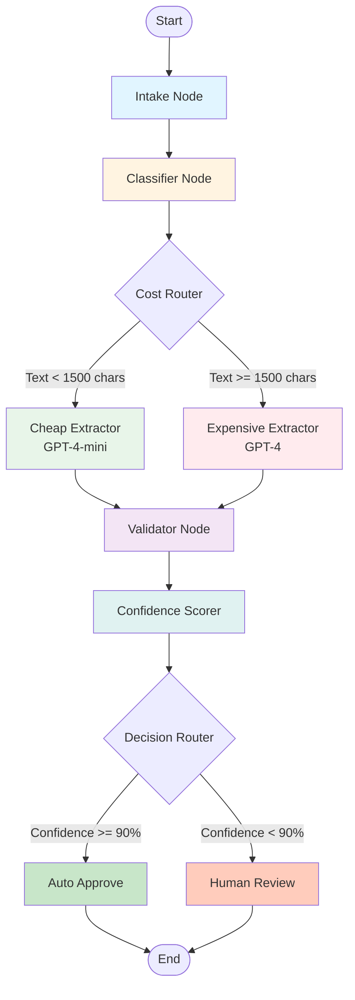
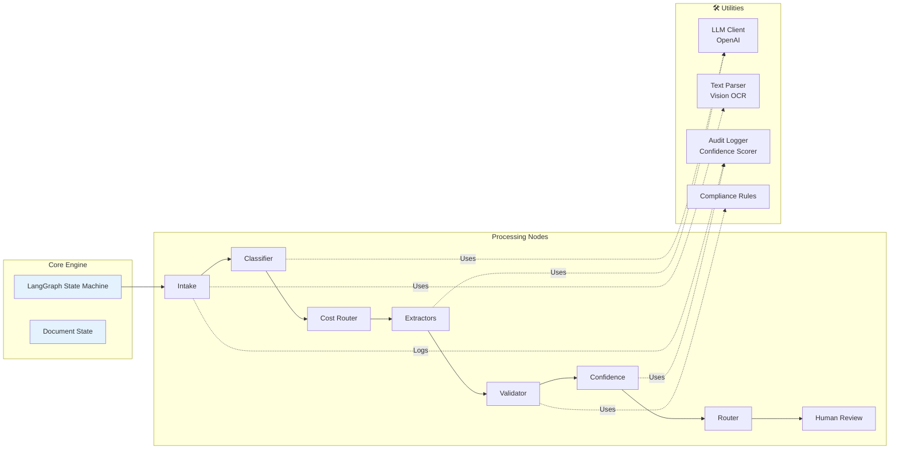
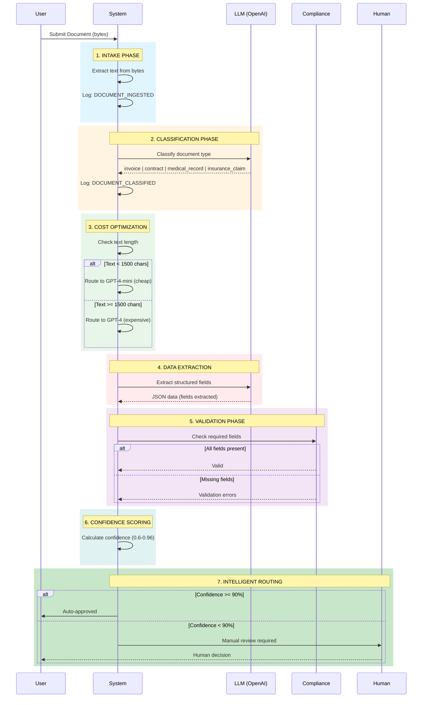
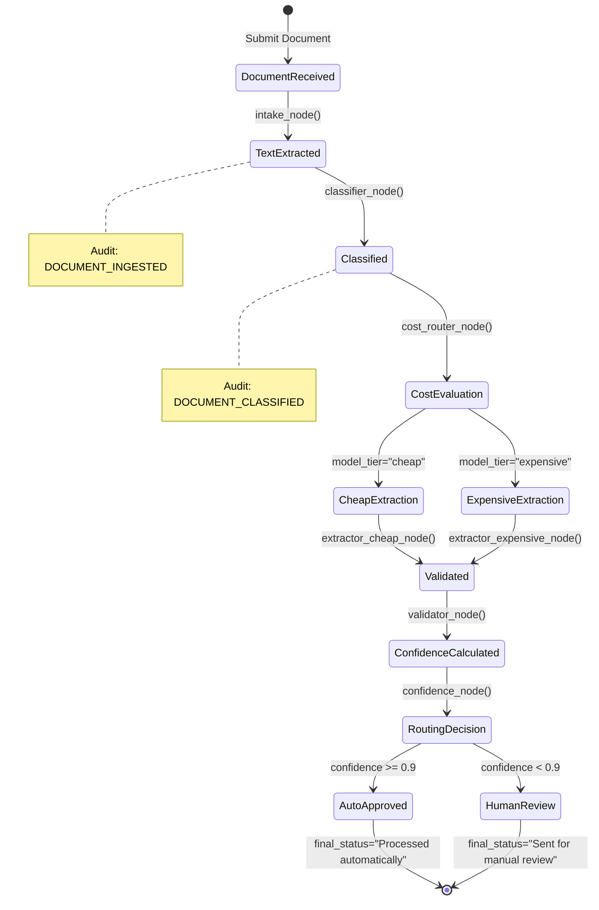
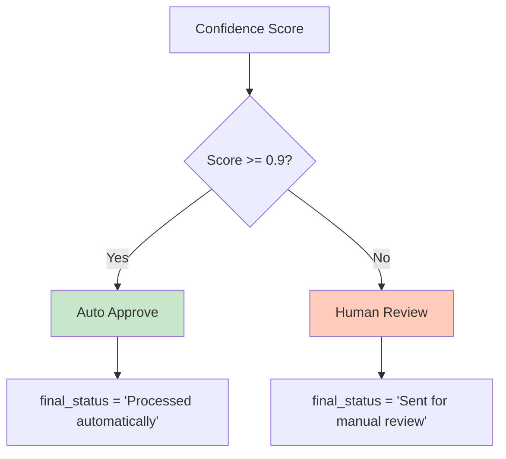

# Intelligent Document Processing System

[](https://www.python.org/downloads/)
[](https://github.com/langchain-ai/langgraph)
[](https://openai.com/)

> An intelligent, cost optimized document processing pipeline built with LangGraph that automatically classifies, extracts, validates and routes documents with confidence based decision making.

---

## Table of Contents

- [Overview](#overview)
- [Key Features](#key-features)
- [Architecture](#architecture)
- [System Flow](#system-flow)
- [Installation](#installation)
- [Quick Start](#quick-start)
- [Project Structure](#project-structure)
- [Detailed Components](#detailed-components)
- [Configuration](#configuration)
- [API Reference](#api-reference)
- [Examples](#examples)

---

## Overview

The Intelligent Document Processing (IDP) system is a **state of the art document automation pipeline** that leverages Large Language Models (LLMs) and intelligent routing to process various document types including invoices, contracts, medical records and insurance claims.

### What Makes This Special?

- **Cost Optimized**: Automatically routes to cheaper models for simple documents  
- **Confidence Based Routing**: High-confidence results auto-approve, low-confidence goes to human review  
- **Compliance Built In**: Validates required fields per document type  
- **Audit Trail**: Complete logging of all document processing steps  
- **Modular Architecture**: Easy to extend with new document types or processing nodes  

---

## Key Features

| Feature | Description |
|---------|-------------|
| **Auto Classification** | Identifies document type (invoice, contract, medical record, insurance claim) |
| **Smart Cost Routing** | Uses GPT-4-mini for simple docs, GPT-4 for complex ones |
| **Data Extraction** | Extracts structured data from unstructured documents |
| **Validation Engine** | Ensures all required fields are present per compliance rules |
| **Confidence Scoring** | Calculates processing confidence (0.6 - 0.96) |
| **Intelligent Routing** | Auto-approves high confidence (≥90%) or routes to human review |
| **Audit Logging** | Tracks every step with timestamps and document IDs |

---

## Architecture

The system is built using **LangGraph**, a framework for building stateful, multi actor applications with LLMs. The architecture follows a directed graph pattern where each node performs a specific task.



### System Components



---

## System Flow

### High Level Process Flow



### State Transitions



---

## Installation

### Prerequisites

- Python 3.8 or higher
- OpenAI API key
- pip package manager

### Step-by-Step Setup

1. **Clone the repository**
```bash
git clone <repository-url>
cd intelligent-document-processing
```

2. **Install dependencies**
```bash
pip install -r requirements.txt
```

3. **Set up environment variables**
```bash
# Create a .env file
echo "OPENAI_API_KEY=your-api-key-here" > .env
```

4. **Verify installation**
```bash
python main.py
```

### Dependencies

```
openai>=1.30.0          # OpenAI API client for LLM interactions
langgraph>=0.0.40       # LangGraph for state machine orchestration
python-dotenv>=1.0.1    # Environment variable management
typing-extensions>=4.9.0 # Type hints for Python < 3.10
```

---

## Quick Start

### Basic Usage

```python
from graph.graph import build_graph

# Build the processing graph
agent = build_graph()

# Process a document
result = agent.invoke({
    "document_id": "DOC_001",
    "raw_document": b"Invoice #123 Amount $450 Date 2025-09-01"
})

# Check results
print("Final Status:", result["final_status"])
print("Confidence:", result["confidence"])
print("Extracted Data:", result["extracted_data"])
```

### Expected Output

```
[AUDIT] 2025-12-28T18:45:55.123456 | DOCUMENT_INGESTED | doc=DOC_001
[AUDIT] 2025-12-28T18:45:56.789012 | DOCUMENT_CLASSIFIED | doc=DOC_001

FINAL STATUS:
Processed automatically
CONFIDENCE: 0.96
```

---

## Project Structure

```
intelligent-document-processing/
│
├──  main.py                          # Entry point for the application
├──  requirements.txt                 # Python dependencies
│
├──  graph/                           # Core graph orchestration
│   ├──  graph.py                     # LangGraph state machine definition
│   ├──  state.py                     # Document state schema (TypedDict)
│   │
│   └──  nodes/                       # Processing nodes (graph vertices)
│       ├──  intake.py                # Document ingestion & text extraction
│       ├──  classifier.py            # Document type classification
│       ├──  cost_router.py           # Model tier selection (cheap/expensive)
│       ├──  extractor_cheap.py       # GPT-4-mini extraction
│       ├──  extractor_expensive.py   # GPT-4 extraction
│       ├──  validator.py             # Field validation against policies
│       ├──  confidence.py            # Confidence score calculation
│       ├──  router.py                # Auto-approve vs human review routing
│       └──  human_review.py          # Human review handler
│
├──  llm/                             # LLM integration
│   └──  client.py                    # OpenAI client wrapper
│
├──  policies/                        # Business rules & compliance
│   └──  compliance.py                # Required field definitions per doc type
│
├──  tools/                           # Utility tools
│   ├──  text_parser.py               # Text extraction from bytes
│   └──  vision.py                    # OCR for image-based documents
│
└──  utils/                           # Helper utilities
    ├──  audit.py                     # Audit logging with timestamps
    └──  scoring.py                   # Confidence score calculation
```

---

##  Detailed Components

### 1. Core State Management

#### `graph/state.py` - Document State Schema

The state object flows through all nodes and maintains document processing context:

```python
class DocumentState(TypedDict):
    # Input
    document_id: str                    # Unique document identifier
    raw_document: bytes                 # Raw document bytes
    
    # Processing
    text: str                           # Extracted text content
    doc_type: str                       # Classified document type
    model_tier: str                     # "cheap" or "expensive"
    
    # Extraction & Validation
    extracted_data: Dict[str, Any]      # Structured extracted fields
    validation_errors: Optional[str]    # Validation error messages
    
    # Decision Making
    confidence: float                   # Confidence score (0.0 - 1.0)
    route: str                          # "auto_approve" or "human_review"
    final_status: str                   # Final processing status
```

**State Flow Example:**

```mermaid
graph LR
    A[Input State] -->|intake| B[+ text]
    B -->|classifier| C[+ doc_type]
    C -->|cost_router| D[+ model_tier]
    D -->|extractor| E[+ extracted_data]
    E -->|validator| F[+ validation_errors]
    F -->|confidence| G[+ confidence]
    G -->|router| H[+ route + final_status]
    
    style A fill:#e3f2fd
    style H fill:#c8e6c9
```



---

### 2. Processing Nodes (The Brain)

#### **Intake Node** (`graph/nodes/intake.py`)

**Purpose:** Convert raw bytes to text and initiate audit trail

```python
def intake_node(state):
    state['text'] = extract_text(state['raw_document'])
    audit("DOCUMENT_INGESTED", state)
    return state
```

**Key Features:**
- Decodes bytes to UTF-8 text
- Handles encoding errors gracefully
- Logs ingestion event with timestamp

---

#### **Classifier Node** (`graph/nodes/classifier.py`)

**Purpose:** Identify document type using LLM

```python
def classifier_node(state):
    prompt = f"""
Classify document type:
invoice, contract, medical_record, insurance_claim

Text:
{state['text'][:1000]}
"""
    state["doc_type"] = call_llm(prompt).strip()
    audit("DOCUMENT_CLASSIFIED", state)
    return state
```

**Supported Document Types:**
-  `invoice` - Invoices and billing documents
-  `contract` - Legal contracts and agreements
-  `medical_record` - Medical and health records
-  `insurance_claim` - Insurance claim forms

**How it works:**
1. Sends first 1000 characters to LLM
2. LLM returns document type
3. Updates state with classification
4. Logs classification event

---

####  **Cost Router Node** (`graph/nodes/cost_router.py`)

**Purpose:** Optimize costs by routing to appropriate model tier

```python
def cost_router_node(state):
    if len(state["text"]) < 1500:
        state["model_tier"] = "cheap"      # GPT-4-mini
    else:
        state["model_tier"] = "expensive"  # GPT-4
    return state
```

**Decision Logic:**

| Text Length | Model Tier | Model Used | Use Case |
|------------|------------|------------|----------|
| < 1500 chars | `cheap` | GPT-4.1-mini | Simple documents, short forms |
| ≥ 1500 chars | `expensive` | GPT-4.1 | Complex documents, long contracts |

**Cost Savings Example:**
```
Simple invoice (500 chars) → GPT-4-mini → $0.0001
Complex contract (5000 chars) → GPT-4 → $0.003

Average cost reduction: ~85% for simple documents
```

---

#### **Cheap Extractor Node** (`graph/nodes/extractor_cheap.py`)

**Purpose:** Extract structured data using cost-effective model

```python
def extractor_cheap_node(state):
    prompt = f"""
Extract key fields from this {state['doc_type']}:

{state['text']}
Return JSON only.
"""
    state["extracted_data"] = eval(call_llm(prompt))
    return state
```

**Model:** GPT-4.1-mini  
**Temperature:** 0.1 (deterministic)  
**Output:** JSON dictionary with extracted fields

---

#### **Expensive Extractor Node** (`graph/nodes/extractor_expensive.py`)

**Purpose:** Extract data from complex documents with higher accuracy

```python
def extractor_expensive_node(state):
    prompt = f"""
Carefully extract ALL required structured fields from this {state['doc_type']}.

{state['text']}
Return strict JSON.
"""
    state["extracted_data"] = eval(
        call_llm(prompt, model="gpt-4.1")
    )
    return state
```

**Model:** GPT-4.1  
**When Used:** Documents with ≥1500 characters  
**Advantage:** Better at complex extraction, multi-page documents

---

####  **Validator Node** (`graph/nodes/validator.py`)

**Purpose:** Ensure compliance by validating required fields

```python
def validator_node(state):
    try:
        validate_required_fields(
            state["doc_type"],
            state["extracted_data"]
        )
        state["validation_errors"] = None
    except Exception as e:
        state["validation_errors"] = str(e)
    return state
```

**Validation Rules (from `policies/compliance.py`):**

```python
REQUIRED_FIELDS = {
    "invoice": {"invoice_number", "amount", "date"},
    "contract": {"party_a", "party_b", "effective_date"},
    # Add more document types...
}
```

**Example Validation:**

```python
# Valid invoice
extracted_data = {
    "invoice_number": "INV-001",
    "amount": 450.00,
    "date": "2025-09-01"
}
#  Passes validation

# Invalid invoice
extracted_data = {
    "invoice_number": "INV-001",
    "amount": 450.00
    # Missing "date"
}
#  Fails: "Missing required fields: {'date'}"
```

---

#### **Confidence Node** (`graph/nodes/confidence.py`)

**Purpose:** Calculate processing confidence score

```python
def confidence_node(state):
    errors = 0 if state["validation_errors"] is None else 1
    state["confidence"] = calculate_confidence(errors)
    return state
```

**Confidence Scoring Logic (from `utils/scoring.py`):**

```python
def calculate_confidence(errors: int) -> float:
    if errors == 0:
        return 0.96    # High confidence - all validations passed
    if errors == 1:
        return 0.85    # Medium confidence - some validation errors
    return 0.6         # Low confidence - multiple errors
```

**Confidence Levels:**

| Score | Level | Meaning | Action |
|-------|-------|---------|--------|
| 0.96 |  High | All fields valid | Auto-approve |
| 0.85 |  Medium | Minor issues | Human review |
| 0.60 |  Low | Major issues | Human review |

---

####  **Router Node** (`graph/nodes/router.py`)

**Purpose:** Intelligently route based on confidence threshold

```python
def router_node(state):
    if state["confidence"] >= 0.9:
        state["route"] = "auto_approve"
        state["final_status"] = "Processed automatically"
    else:
        state["route"] = "human_review"
    return state
```

**Decision Tree:**



**Threshold Rationale:**
- **90% threshold** balances automation with safety
- High-confidence documents (96%) easily clear threshold
- Medium-confidence (85%) documents get human oversight
- Prevents automated processing of uncertain extractions

---

#### 👤 **Human Review Node** (`graph/nodes/human_review.py`)

**Purpose:** Handle documents requiring manual review

```python
def human_review_node(state):
    state["final_status"] = "Sent for manual review"
    return state
```

**In Production, This Would:**
- Queue document to review dashboard
- Notify reviewers via email/Slack
- Track review SLAs
- Log review decisions

---

### 3. LLM Integration

#### `llm/client.py` - OpenAI Client Wrapper

**Purpose:** Centralized LLM communication with caching

```python
_client = None

def get_client():
    global _client
    if _client is None:
        _client = OpenAI(api_key=os.getenv("OPENAI_API_KEY"))
    return _client

def call_llm(prompt: str, model="gpt-4.1-mini") -> str:
    client = get_client()
    res = client.chat.completions.create(
        model=model,
        temperature=0.1,  # Low temperature for consistency
        messages=[{"role": "user", "content": prompt}]
    )
    return res.choices[0].message.content or ""
```

**Features:**
-  Singleton pattern for client reuse
-  Environment-based API key management
-  Low temperature (0.1) for deterministic outputs
-  Simple interface for node usage

---

### 4. Utilities & Tools

#### `utils/audit.py` - Audit Trail

```python
def audit(event: str, state):
    ts = datetime.datetime.utcnow().isoformat()
    print(f"[AUDIT] {ts} | {event} | doc={state['document_id']}")
```

**Sample Output:**
```
[AUDIT] 2025-12-28T18:45:55.123456 | DOCUMENT_INGESTED | doc=DOC_001
[AUDIT] 2025-12-28T18:45:56.789012 | DOCUMENT_CLASSIFIED | doc=DOC_001
```

**Production Enhancement Ideas:**
- Write to database or log aggregation service (Splunk, DataDog)
- Include user information and IP addresses
- Track processing time per node
- Monitor error rates

---

#### `utils/scoring.py` - Confidence Scoring

Provides confidence calculation based on validation results.

---

#### `tools/text_parser.py` - Text Extraction

```python
def extract_text(raw: bytes) -> str:
    return raw.decode("utf-8", errors='ignore')
```

Handles text extraction from byte streams with error tolerance.

---

#### `tools/vision.py` - OCR Support

```python
def extract_text_from_image(raw: bytes) -> str:
    return "OCR extracted text"  # Placeholder for OCR integration
```

**Future Enhancement:** Integrate with:
- Tesseract OCR
- AWS Textract
- Google Cloud Vision API
- Azure Computer Vision

---

### 5. Policies & Compliance

#### `policies/compliance.py` - Business Rules

```python
REQUIRED_FIELDS = {
    "invoice": {"invoice_number", "amount", "date"},
    "contract": {"party_a", "party_b", "effective_date"},
}

def validate_required_fields(doc_type: str, data: dict):
    required = REQUIRED_FIELDS.get(doc_type, set())
    missing = required - data.keys()
    if missing:
        raise ValueError(f"Missing required fields: {missing}")
```

**Extensibility Example:**

```python
# Add new document type
REQUIRED_FIELDS["purchase_order"] = {
    "po_number", "vendor", "amount", "delivery_date"
}

# Add optional fields validation
OPTIONAL_FIELDS = {
    "invoice": {"tax", "discount", "payment_terms"}
}
```

---

## Configuration

### Environment Variables

Create a `.env` file in the project root:

```bash
# Required
OPENAI_API_KEY=sk-your-api-key-here

# Optional Configuration
MODEL_CHEAP=gpt-4.1-mini              # Default model for simple documents
MODEL_EXPENSIVE=gpt-4.1               # Default model for complex documents
CONFIDENCE_THRESHOLD=0.9              # Auto-approve threshold (0.0 - 1.0)
TEXT_LENGTH_THRESHOLD=1500            # Characters threshold for cost routing
TEMPERATURE=0.1                       # LLM temperature for consistency
```

### Customizing the Pipeline

#### Add a New Document Type

**Step 1:** Update `policies/compliance.py`

```python
REQUIRED_FIELDS = {
    "invoice": {"invoice_number", "amount", "date"},
    "contract": {"party_a", "party_b", "effective_date"},
    "purchase_order": {"po_number", "vendor", "amount", "delivery_date"},  # New!
}
```

**Step 2:** Update the classifier prompt in `graph/nodes/classifier.py`

```python
prompt = f"""
Classify document type:
invoice, contract, medical_record, insurance_claim, purchase_order

Text:
{state['text'][:1000]}
"""
```

#### Adjust Confidence Threshold

Modify `graph/nodes/router.py`:

```python
def router_node(state):
    # Change threshold from 0.9 to 0.85 for more automation
    if state["confidence"] >= 0.85:
        state["route"] = "auto_approve"
        state["final_status"] = "Processed automatically"
    else:
        state["route"] = "human_review"
    return state
```

#### Modify Cost Routing Logic

Update `graph/nodes/cost_router.py`:

```python
def cost_router_node(state):
    # Add document type consideration
    if state["doc_type"] == "contract":
        state["model_tier"] = "expensive"  # Always use GPT-4 for contracts
    elif len(state["text"]) < 1500:
        state["model_tier"] = "cheap"
    else:
        state["model_tier"] = "expensive"
    return state
```

---

## API Reference

### Main Entry Point

#### `build_graph()`

Builds and compiles the LangGraph state machine.

```python
from graph.graph import build_graph

agent = build_graph()
```

**Returns:** Compiled LangGraph application

---

### Core Functions

#### `agent.invoke(input_state)`

Processes a document through the entire pipeline.

**Parameters:**
- `input_state` (dict): Initial state containing:
  - `document_id` (str): Unique identifier for the document
  - `raw_document` (bytes): Raw document content as bytes

**Returns:** Final state (dict) containing:
- `document_id` (str): Original document ID
- `text` (str): Extracted text
- `doc_type` (str): Classified document type
- `model_tier` (str): Model tier used ("cheap" or "expensive")
- `extracted_data` (dict): Structured extracted data
- `validation_errors` (str | None): Any validation errors
- `confidence` (float): Confidence score (0.0 - 1.0)
- `route` (str): Routing decision ("auto_approve" or "human_review")
- `final_status` (str): Final processing status

**Example:**

```python
result = agent.invoke({
    "document_id": "INV-2025-001",
    "raw_document": b"Invoice #12345 Amount $1,250.00 Date 2025-12-28"
})

print(f"Status: {result['final_status']}")
print(f"Confidence: {result['confidence']}")
print(f"Data: {result['extracted_data']}")
```

---

### Utility Functions

#### `call_llm(prompt, model)`

Calls OpenAI LLM with the given prompt.

```python
from llm.client import call_llm

response = call_llm(
    prompt="Extract invoice number from: Invoice #123",
    model="gpt-4.1-mini"  # Optional, defaults to gpt-4.1-mini
)
```

#### `audit(event, state)`

Logs an audit event.

```python
from utils.audit import audit

audit("CUSTOM_EVENT", state)
# Output: [AUDIT] 2025-12-28T18:45:55.123456 | CUSTOM_EVENT | doc=DOC_001
```

#### `calculate_confidence(errors)`

Calculates confidence score based on error count.

```python
from utils.scoring import calculate_confidence

confidence = calculate_confidence(0)  # Returns 0.96
confidence = calculate_confidence(1)  # Returns 0.85
confidence = calculate_confidence(2)  # Returns 0.6
```

---

## Examples

### Example 1: Processing an Invoice

```python
from graph.graph import build_graph

agent = build_graph()

invoice_text = """
INVOICE

Invoice Number: INV-2025-001
Date: 2025-12-28
Amount: $1,250.00
Vendor: Acme Corp
"""

result = agent.invoke({
    "document_id": "INV-2025-001",
    "raw_document": invoice_text.encode('utf-8')
})

print(f"Document Type: {result['doc_type']}")
print(f"Model Used: {result['model_tier']}")
print(f"Extracted Data: {result['extracted_data']}")
print(f"Confidence: {result['confidence']}")
print(f"Final Status: {result['final_status']}")
```

**Expected Output:**

```
[AUDIT] 2025-12-28T18:45:55.123456 | DOCUMENT_INGESTED | doc=INV-2025-001
[AUDIT] 2025-12-28T18:45:56.789012 | DOCUMENT_CLASSIFIED | doc=INV-2025-001

Document Type: invoice
Model Used: cheap
Extracted Data: {'invoice_number': 'INV-2025-001', 'amount': 1250.0, 'date': '2025-12-28'}
Confidence: 0.96
Final Status: Processed automatically
```

---

### Example 2: Processing a Contract (High Volume)

```python
from graph.graph import build_graph

agent = build_graph()

contract_text = """
COMMERCIAL LEASE AGREEMENT

This Lease Agreement ("Agreement") is entered into on December 28, 2025
between ABC Real Estate LLC ("Party A") and XYZ Corporation ("Party B").

[... 2000+ characters of legal text ...]

Effective Date: 2025-12-28
""" * 3  # Long document

result = agent.invoke({
    "document_id": "CONTRACT-2025-001",
    "raw_document": contract_text.encode('utf-8')
})

print(f"Model Tier: {result['model_tier']}")  # "expensive" due to length
print(f"Confidence: {result['confidence']}")
print(f"Status: {result['final_status']}")
```

---

### Example 3: Batch Processing

```python
from graph.graph import build_graph
import concurrent.futures

agent = build_graph()

documents = [
    {"document_id": "DOC-001", "raw_document": b"Invoice #001..."},
    {"document_id": "DOC-002", "raw_document": b"Contract between..."},
    {"document_id": "DOC-003", "raw_document": b"Invoice #002..."},
]

def process_document(doc):
    return agent.invoke(doc)

# Process in parallel
with concurrent.futures.ThreadPoolExecutor(max_workers=5) as executor:
    results = list(executor.map(process_document, documents))

# Analyze results
auto_approved = sum(1 for r in results if r['route'] == 'auto_approve')
human_review = sum(1 for r in results if r['route'] == 'human_review')

print(f"Auto-approved: {auto_approved}/{len(documents)}")
print(f"Human review: {human_review}/{len(documents)}")
```

---

### Example 4: Custom Validation

```python
from graph.graph import build_graph
from policies.compliance import REQUIRED_FIELDS

# Add custom validation rules
REQUIRED_FIELDS["custom_invoice"] = {
    "invoice_number", "amount", "date", "tax_id", "vendor"
}

agent = build_graph()

result = agent.invoke({
    "document_id": "CUSTOM-001",
    "raw_document": b"Custom invoice with special fields..."
})

if result['validation_errors']:
    print(f"Validation failed: {result['validation_errors']}")
else:
    print("Validation passed!")
```

---

### Example 5: Error Handling

```python
from graph.graph import build_graph

agent = build_graph()

try:
    result = agent.invoke({
        "document_id": "TEST-001",
        "raw_document": b"Malformed document..."
    })
    
    if result['final_status'] == "Sent for manual review":
        print(" Document needs human review")
        print(f"Reason: Confidence {result['confidence']} < 0.9")
        print(f"Validation errors: {result.get('validation_errors')}")
    else:
        print(" Document processed successfully")
        
except Exception as e:
    print(f" Processing failed: {str(e)}")
```

---

## Advanced Usage

### Custom Node Implementation

Create a new node for additional processing:

```python
# graph/nodes/quality_check.py
def quality_check_node(state):
    """Additional quality checks on extracted data"""
    data = state['extracted_data']
    
    # Example: Check if amount is reasonable
    if 'amount' in data and data['amount'] > 1000000:
        state['validation_errors'] = "Amount exceeds threshold"
    
    return state
```

Add it to the graph:

```python
# graph/graph.py
from graph.nodes.quality_check import quality_check_node

def build_graph():
    g = StateGraph(DocumentState)
    
    # ... existing nodes ...
    g.add_node("quality_check", quality_check_node)
    
    # Insert between validator and confidence
    g.add_edge("validate", "quality_check")
    g.add_edge("quality_check", "confidence")
    
    return g.compile()
```

---

### Integrating with Web API

```python
from fastapi import FastAPI, UploadFile, File
from graph.graph import build_graph

app = FastAPI()
agent = build_graph()

@app.post("/process-document")
async def process_document(
    document_id: str,
    file: UploadFile = File(...)
):
    content = await file.read()
    
    result = agent.invoke({
        "document_id": document_id,
        "raw_document": content
    })
    
    return {
        "document_id": result['document_id'],
        "doc_type": result['doc_type'],
        "confidence": result['confidence'],
        "status": result['final_status'],
        "extracted_data": result['extracted_data']
    }

# Run with: uvicorn api:app --reload
```

---

## Performance Metrics

### Typical Processing Times

| Document Type | Size | Model | Processing Time |
|--------------|------|-------|-----------------|
| Simple Invoice | < 500 chars | GPT-4-mini | ~1-2 seconds |
| Standard Contract | 1000-2000 chars | GPT-4-mini | ~2-3 seconds |
| Complex Contract | > 2000 chars | GPT-4 | ~3-5 seconds |
| Medical Record | 1500 chars | GPT-4 | ~3-4 seconds |

### Cost Analysis

| Scenario | Documents/Day | Avg Cost/Doc | Monthly Cost |
|----------|--------------|--------------|--------------|
| Small Business | 100 | $0.002 | $6 |
| Medium Business | 1,000 | $0.002 | $60 |
| Enterprise | 10,000 | $0.0015 | $450 |

*Assumes 70% cheap model usage, 30% expensive model usage*

---

## Testing

### Run the Example

```bash
python main.py
```

### Unit Testing (Future Enhancement)

```python
# tests/test_classifier.py
import pytest
from graph.nodes.classifier import classifier_node

def test_invoice_classification():
    state = {
        "document_id": "TEST-001",
        "text": "Invoice #123 Amount $500"
    }
    result = classifier_node(state)
    assert result['doc_type'] == 'invoice'

def test_contract_classification():
    state = {
        "document_id": "TEST-002",
        "text": "Agreement between Party A and Party B"
    }
    result = classifier_node(state)
    assert result['doc_type'] == 'contract'
```

---

## Deployment

### Docker Deployment

Create `Dockerfile`:

```dockerfile
FROM python:3.11-slim

WORKDIR /app

COPY requirements.txt .
RUN pip install --no-cache-dir -r requirements.txt

COPY . .

ENV OPENAI_API_KEY=""

CMD ["python", "main.py"]
```

Build and run:

```bash
docker build -t idp-system .
docker run -e OPENAI_API_KEY=your-key idp-system
```

### Cloud Deployment Options

- **AWS Lambda**: For serverless document processing
- **Google Cloud Run**: Containerized deployment with auto-scaling
- **Azure Functions**: Event-driven document processing
- **Kubernetes**: For high-volume enterprise deployments

---

##  Security Considerations

### Best Practices

1. **API Key Management**
   - Never commit API keys to version control
   - Use environment variables or secret managers (AWS Secrets Manager, Azure Key Vault)
   - Rotate keys regularly

2. **Data Privacy**
   - Sanitize sensitive information before logging
   - Implement data retention policies
   - Consider using PII detection/redaction

3. **Audit Trail**
   - Log all document access and processing
   - Store audit logs in secure, tamper-proof storage
   - Implement log retention policies

4. **Validation**
   - Validate input document sizes (prevent DoS)
   - Sanitize extracted data before storage
   - Implement rate limiting

---

## Troubleshooting

### Common Issues

#### Issue: "OpenAI API key not found"

```bash
# Solution: Set environment variable
export OPENAI_API_KEY="your-key-here"
# Or create .env file
echo "OPENAI_API_KEY=your-key-here" > .env
```

#### Issue: "Module not found" errors

```bash
# Solution: Reinstall dependencies
pip install -r requirements.txt
```

#### Issue: Low confidence scores

```python
# Check validation errors
if result['confidence'] < 0.9:
    print(f"Validation errors: {result['validation_errors']}")
    print(f"Extracted data: {result['extracted_data']}")
```


