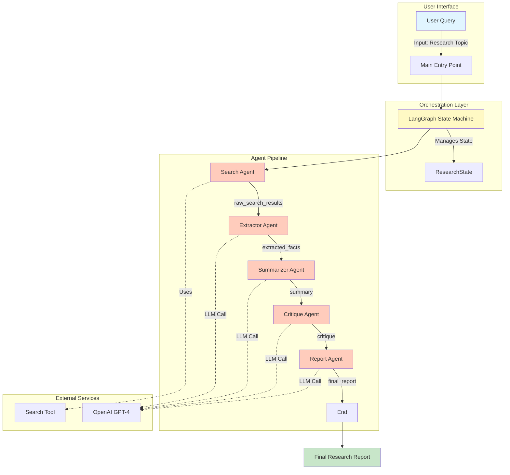
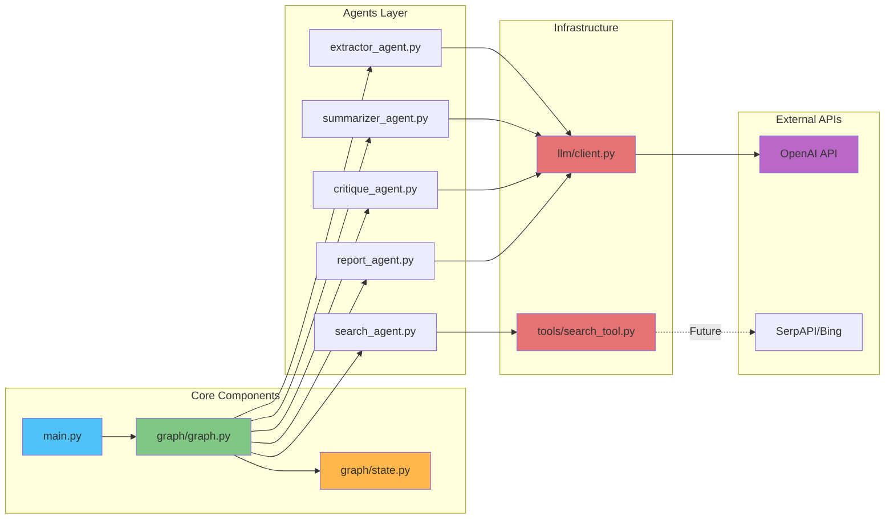
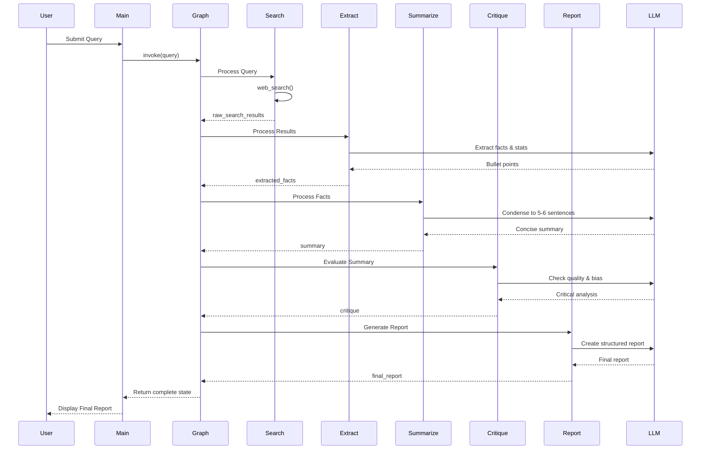
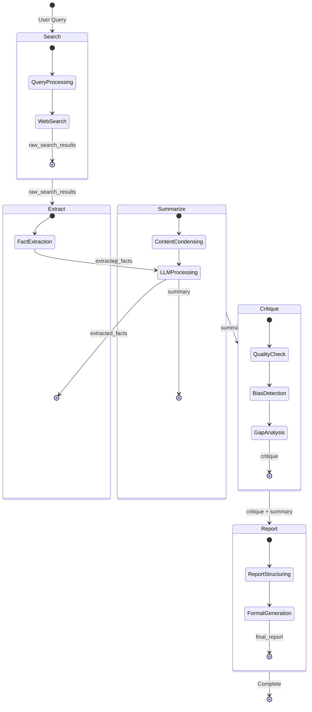
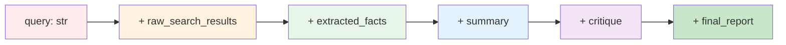

# 🔬 Multi Agent Research System

<div align="center">


*An intelligent multi-agent orchestration system that transforms user queries into comprehensive research reports through collaborative AI agents*

[Features](#-features) • [Architecture](#-architecture) • [Quick Start](#-quick-start) • [How It Works](#-how-it-works) • [Documentation](#-documentation)

</div>

---

## 📋 Table of Contents

- [Overview](#-overview)
- [Features](#-features)
- [Architecture](#-architecture)
- [System Flow](#-system-flow)
- [Agent Breakdown](#-agent-breakdown)
- [State Management](#-state-management)
- [Quick Start](#-quick-start)
- [Project Structure](#-project-structure)
- [Code Deep Dive](#-code-deep-dive)
- [Configuration](#-configuration)
- [Extending the System](#-extending-the-system)
- [Contributing](#-contributing)

---

## 🌟 Overview

The **Multi-Agent Research System** is a sophisticated AI-powered research assistant that leverages the power of multiple specialized agents working in a coordinated pipeline. Built on LangGraph and powered by OpenAI's GPT-4, this system transforms simple user queries into professional, well-researched reports.

### Why Multi-Agent?

Traditional single agent systems often struggle with complex tasks requiring multiple cognitive skills. This system breaks down the research process into specialized stages:

- 🔍 **Information Gathering** - Raw data collection
- 🎯 **Fact Extraction** - Identifying key insights
- 📝 **Summarization** - Condensing information
- 🔬 **Critical Analysis** - Quality assurance
- 📊 **Report Generation** - Professional output formatting

---

## ✨ Features

### 🤖 Five Specialized Agents
Each agent is an expert in its domain, working together seamlessly:
- **Search Agent** - Retrieves relevant information
- **Extractor Agent** - Identifies facts, statistics and key claims
- **Summarizer Agent** - Creates concise, readable summaries
- **Critique Agent** - Ensures quality and identifies gaps
- **Report Agent** - Generates professional research reports

### 🔄 Stateful Workflow
- Maintains context across all agent interactions
- Each agent builds upon previous results
- Transparent state transitions

### 🎯 Key Capabilities
- ✅ Automated research pipeline
- ✅ Bias detection and quality assurance
- ✅ Professional report formatting
- ✅ Extensible architecture
- ✅ Type-safe state management

---

## 🏗️ Architecture

### System Architecture Diagram



### Component Architecture



---

## 🔄 System Flow

### Complete Execution Flow



### State Transformation Flow



---

## 🤖 Agent Breakdown

### 1. 🔍 Search Agent
**Purpose**: Initial information gathering

```python
# Location: graph/agents/search_agent.py
def search_agent(state: ResearchState):
    state["raw_search_results"] = web_search(state['query'])
    return state
```

**Responsibilities**:
- Receives user query from state
- Invokes search tool (web/RAG)
- Returns raw search results
- **Future Enhancement**: Integration with SerpAPI or Bing Search API

**Input**: `query` (string)  
**Output**: `raw_search_results` (string)

---

### 2. 🎯 Extractor Agent
**Purpose**: Identify and extract key information

```python
# Location: graph/agents/extractor_agent.py
def extractor_agent(state: ResearchState):
    prompt = """
    Extract factual points, statistics and key claims from the following content.
    Return bullet points only.
    
    Content: {state['raw_search_results']}
    """
    state['extracted_facts'] = call_llm(prompt)
    return state
```

**Responsibilities**:
- Parses raw search results
- Extracts factual points, statistics, and key claims
- Formats output as bullet points
- Filters out noise and irrelevant information

**Input**: `raw_search_results` (string)  
**Output**: `extracted_facts` (string)

**LLM Prompt Strategy**: Focused extraction with structured output format

---

### 3. 📝 Summarizer Agent
**Purpose**: Condense information into digestible format

```python
# Location: graph/agents/summarizer_agent.py
def summarizer_agent(state: ResearchState):
    prompt = """
    Summarize the following extracted facts into 5-6 concise sentences.
    
    Facts: {state['extracted_facts']}
    """
    state['summary'] = call_llm(prompt)
    return state
```

**Responsibilities**:
- Condenses extracted facts
- Creates coherent narrative (5-6 sentences)
- Maintains factual accuracy
- Improves readability

**Input**: `extracted_facts` (string)  
**Output**: `summary` (string)

**LLM Prompt Strategy**: Conciseness constraint with clarity focus

---

### 4. 🔬 Critique Agent
**Purpose**: Quality assurance and bias detection

```python
# Location: graph/agents/critique_agent.py
def critique_agent(state: ResearchState):
    prompt = """
    Critically evaluate the following summary.
    
    Check for: 
    - Missing perspectives
    - Bias
    - Weak reasoning
    - Unclear claims
    
    Provide short critique and improvement suggestions.
    
    Summary: {state['summary']}
    """
    state['critique'] = call_llm(prompt)
    return state
```

**Responsibilities**:
- Critical evaluation of summary
- Bias detection
- Gap identification
- Quality assessment
- Improvement suggestions

**Evaluation Criteria**:
- ✓ Missing perspectives
- ✓ Potential bias
- ✓ Weak reasoning
- ✓ Unclear claims

**Input**: `summary` (string)  
**Output**: `critique` (string)

**LLM Prompt Strategy**: Multi-criteria evaluation framework

---

### 5. 📊 Report Agent
**Purpose**: Professional report generation

```python
# Location: graph/agents/report_agent.py
def report_agent(state: ResearchState):
    prompt = """
    Generate a professional research report using:
    
    Summary: {state['summary']}
    Critique: {state['critique']}
    
    The report should include:
    - Title
    - Executive summary
    - Key findings
    - Limitations
    - Conclusion
    """
    state["final_report"] = call_llm(prompt)
    return state
```

**Responsibilities**:
- Synthesizes summary and critique
- Creates structured professional report
- Formats with proper sections
- Ensures academic/professional tone

**Report Structure**:
1. **Title** - Research topic
2. **Executive Summary** - High-level overview
3. **Key Findings** - Main insights
4. **Limitations** - Identified gaps and biases
5. **Conclusion** - Final synthesis

**Input**: `summary` (string), `critique` (string)  
**Output**: `final_report` (string)

**LLM Prompt Strategy**: Structured output with section requirements

---

## 🗂️ State Management

### ResearchState Schema

```python
# Location: graph/state.py
class ResearchState(TypedDict):
    query: str                      # User's research question
    raw_search_results: str         # Raw data from search
    extracted_facts: Optional[str]  # Bullet-pointed facts
    summary: Optional[str]          # Condensed summary
    critique: Optional[str]         # Quality evaluation
    final_report: Optional[str]     # Final formatted report
```

### State Evolution Diagram



### Type Safety
- Uses `TypedDict` for compile-time type checking
- `Optional` fields ensure proper initialization
- Clear data contracts between agents

---

## 🚀 Quick Start

### Prerequisites

```bash
# Python 3.8 or higher
python --version

# pip package manager
pip --version
```

### Installation

1. **Clone the repository**
```bash
git clone https://github.com/aaryan182/ai_agents_prod_langgraph.git
cd multi-agent-research-system
```

2. **Install dependencies**
```bash
pip install -r requirements.txt
```

3. **Set up OpenAI API key**
```bash
# Create .env file
echo "OPENAI_API_KEY=your_api_key_here" > .env
```

### Running the System

**Basic Usage:**
```bash
python main.py
```

**Custom Query:**
```python
from graph.graph import build_graph

# Build the agent graph
agent = build_graph()

# Run research query
result = agent.invoke({
    "query": "Your research question here"
})

# Access the final report
print(result["final_report"])
```

### Example Output

```
===== FINAL RESEARCH REPORT =====

Title: Impact of AI on Software Engineering Productivity

Executive Summary:
Recent studies indicate that AI tools are significantly transforming 
software development workflows, with developers reporting 30-50% 
productivity gains when using AI-assisted coding tools...

Key Findings:
1. Code completion tools reduce development time by 40%
2. AI-powered debugging identifies issues 60% faster
3. Documentation generation saves 5-10 hours per week
...

Limitations:
- Limited data on long-term adoption patterns
- Potential over-reliance on AI suggestions
...

Conclusion:
AI integration in software engineering shows promising results...
```

---

## 📁 Project Structure

```
multi-agent-research-system/
│
├── 📄 main.py                    # Application entry point
├── 📄 requirements.txt            # Python dependencies
├── 📄 multi_agent_research_system.txt  # System documentation
│
├── 📁 graph/                      # State machine & orchestration
│   ├── 📄 __init__.py
│   ├── 📄 graph.py               # LangGraph workflow definition
│   ├── 📄 state.py               # ResearchState schema
│   │
│   └── 📁 agents/                # Individual agent implementations
│       ├── 📄 __init__.py
│       ├── 📄 search_agent.py    # Information retrieval
│       ├── 📄 extractor_agent.py # Fact extraction
│       ├── 📄 summarizer_agent.py # Content condensing
│       ├── 📄 critique_agent.py  # Quality assurance
│       └── 📄 report_agent.py    # Report generation
│
├── 📁 llm/                        # LLM integration layer
│   ├── 📄 __init__.py
│   └── 📄 client.py              # OpenAI client wrapper
│
└── 📁 tools/                      # External tools & utilities
    ├── 📄 __init__.py
    └── 📄 search_tool.py         # Web search functionality
```

---

## 🔍 Code Deep Dive

### Graph Construction

The system uses LangGraph to create a directed acyclic graph (DAG) of agent nodes:

```python
# graph/graph.py
from langgraph.graph import StateGraph, END
from graph.state import ResearchState

def build_graph():
    # Initialize state graph
    g = StateGraph(ResearchState)
    
    # Add agent nodes
    g.add_node("search", search_agent)
    g.add_node("extract", extractor_agent)
    g.add_node("summarize", summarizer_agent)
    g.add_node("critique", critique_agent)
    g.add_node("report", report_agent)
    
    # Set entry point
    g.set_entry_point("search")
    
    # Define linear pipeline
    g.add_edge("search", "extract")
    g.add_edge("extract", "summarize")
    g.add_edge("summarize", "critique")
    g.add_edge("critique", "report")
    g.add_edge("report", END)
    
    # Compile to executable graph
    return g.compile()
```

**Key Concepts**:
- **StateGraph**: Manages state transitions between agents
- **Nodes**: Individual agent functions
- **Edges**: Define execution order
- **Entry Point**: First agent to execute
- **END**: Terminal state

### LLM Client

Centralized LLM interaction with consistent error handling:

```python
# llm/client.py
from openai import OpenAI

client = OpenAI()  # Uses OPENAI_API_KEY from environment

def call_llm(prompt: str, model="gpt-4.1"):
    """
    Unified LLM calling function
    
    Args:
        prompt: User/system prompt
        model: OpenAI model identifier
        
    Returns:
        str: Model's text response
    """
    res = client.chat.completions.create(
        model=model,
        messages=[{"role": "user", "content": prompt}]
    )
    return res.choices[0].message.content
```

**Benefits**:
- Single point of configuration
- Easy model switching
- Consistent error handling
- Simplified agent code

### Search Tool

Modular search implementation with extensibility:

```python
# tools/search_tool.py
def web_search(query: str) -> str:
    """
    Mock search function - replace with real API
    
    Future integrations:
    - SerpAPI for Google results
    - Bing Search API
    - Custom RAG system
    - Vector database search
    """
    return f"""
    Search results for "{query}":
    
    - Article 1: Key trends and statistics
    - Article 2: Industry insights
    - Article 3: Expert opinions
    """
```

**Extension Points**:
```python
# Example: SerpAPI integration
from serpapi import GoogleSearch

def web_search(query: str) -> str:
    search = GoogleSearch({
        "q": query,
        "api_key": os.getenv("SERP_API_KEY")
    })
    results = search.get_dict()
    return format_search_results(results)
```

---

## ⚙️ Configuration

### Environment Variables

Create a `.env` file in the project root:

```bash
# OpenAI Configuration
OPENAI_API_KEY=sk-...

# Optional: Custom model
OPENAI_MODEL=gpt-4-turbo-preview

# Future: Search API keys
SERP_API_KEY=...
BING_API_KEY=...
```

### Model Selection

Modify `llm/client.py` to change the default model:

```python
def call_llm(prompt: str, model="gpt-4-turbo-preview"):
    # Your implementation
```

**Supported Models**:
- `gpt-4` - Most capable, slower
- `gpt-4-turbo-preview` - Fast, high quality
- `gpt-3.5-turbo` - Fast, cost-effective

### Agent Customization

Each agent can be modified independently. Example:

```python
# graph/agents/summarizer_agent.py
def summarizer_agent(state: ResearchState):
    prompt = f"""
    Summarize into 3-4 sentences.  # Changed from 5-6
    Focus on technical details.      # Added constraint
    
    Facts: {state['extracted_facts']}
    """
    state['summary'] = call_llm(prompt)
    return state
```

---

## 🔧 Extending the System

### Adding a New Agent

**1. Create agent file:**
```python
# graph/agents/my_new_agent.py
from llm.client import call_llm
from graph.state import ResearchState

def my_new_agent(state: ResearchState):
    # Your logic here
    prompt = f"Process this: {state['some_field']}"
    state['new_field'] = call_llm(prompt)
    return state
```

**2. Update state schema:**
```python
# graph/state.py
class ResearchState(TypedDict):
    # ... existing fields ...
    new_field: Optional[str]  # Add new field
```

**3. Integrate into graph:**
```python
# graph/graph.py
from graph.agents.my_new_agent import my_new_agent

def build_graph():
    g = StateGraph(ResearchState)
    g.add_node("my_new", my_new_agent)
    
    # Insert into pipeline
    g.add_edge("summarize", "my_new")
    g.add_edge("my_new", "critique")
```

### Adding Conditional Routing

Enable dynamic agent selection:

```python
def should_critique_again(state: ResearchState) -> str:
    """Decide next node based on state"""
    if "needs improvement" in state['critique'].lower():
        return "summarize"  # Go back to summarizer
    return "report"  # Proceed to report

# In build_graph()
g.add_conditional_edges(
    "critique",
    should_critique_again,
    {
        "summarize": "summarize",
        "report": "report"
    }
)
```

### Integrating Real Search APIs

**SerpAPI Integration:**
```python
# tools/search_tool.py
import os
from serpapi import GoogleSearch

def web_search(query: str) -> str:
    search = GoogleSearch({
        "q": query,
        "num": 10,
        "api_key": os.getenv("SERP_API_KEY")
    })
    
    results = search.get_dict()
    organic_results = results.get("organic_results", [])
    
    formatted = []
    for r in organic_results:
        formatted.append(f"- {r['title']}: {r['snippet']}")
    
    return "\n".join(formatted)
```

**RAG System Integration:**
```python
from langchain.vectorstores import Chroma
from langchain.embeddings import OpenAIEmbeddings

def web_search(query: str) -> str:
    vectorstore = Chroma(
        persist_directory="./chroma_db",
        embedding_function=OpenAIEmbeddings()
    )
    
    docs = vectorstore.similarity_search(query, k=5)
    return "\n\n".join([doc.page_content for doc in docs])
```

---

## 🎯 Use Cases

### Academic Research
```python
result = agent.invoke({
    "query": "Latest developments in quantum computing algorithms"
})
```

### Market Analysis
```python
result = agent.invoke({
    "query": "Impact of renewable energy on traditional utilities"
})
```

### Technical Investigation
```python
result = agent.invoke({
    "query": "Comparison of microservices vs monolithic architectures"
})
```

### Trend Analysis
```python
result = agent.invoke({
    "query": "Evolution of remote work technologies post-pandemic"
})
```

---

## 🐛 Troubleshooting

### Common Issues

**1. OpenAI API Key Error**
```
Error: OpenAI API key not found
```
**Solution**: Set `OPENAI_API_KEY` in `.env` file or environment

**2. Module Import Error**
```
ModuleNotFoundError: No module named 'langgraph'
```
**Solution**: Run `pip install -r requirements.txt`

**3. Model Not Found**
```
Error: The model 'gpt-4.1' does not exist
```
**Solution**: Check available models or use `gpt-4-turbo-preview`

### Debug Mode

Enable verbose logging:

```python
import logging

logging.basicConfig(level=logging.DEBUG)

# Now run your agent
agent = build_graph()
result = agent.invoke({"query": "..."})
```

---

## 📊 Performance Considerations

### Latency Breakdown

```mermaid
gantt
    title Agent Execution Timeline (Typical)
    dateFormat X
    axisFormat %S
    
    section Search
    Search Agent: 0, 2s
    
    section Extract
    Extractor Agent: 2s, 5s
    
    section Summarize
    Summarizer Agent: 5s, 8s
    
    section Critique
    Critique Agent: 8s, 11s
    
    section Report
    Report Agent: 11s, 15s
```

**Optimization Strategies**:
- Use faster models (`gpt-3.5-turbo`) for non-critical agents
- Implement caching for repeated queries
- Parallel execution where possible
- Streaming responses for better UX

### Cost Estimation

| Agent | Model | Avg Tokens | Cost/Run |
|-------|-------|-----------|----------|
| Search | N/A | 0 | $0.00 |
| Extractor | GPT-4 | 1,500 | $0.045 |
| Summarizer | GPT-4 | 800 | $0.024 |
| Critique | GPT-4 | 1,000 | $0.030 |
| Report | GPT-4 | 2,000 | $0.060 |
| **Total** | | **5,300** | **$0.159** |

*Based on GPT-4 pricing: $0.03/1K input tokens, $0.06/1K output tokens*

---

## 🧪 Testing

### Unit Tests

```python
# tests/test_agents.py
from graph.agents.search_agent import search_agent

def test_search_agent():
    state = {"query": "test query"}
    result = search_agent(state)
    assert "raw_search_results" in result
    assert len(result["raw_search_results"]) > 0
```

### Integration Tests

```python
# tests/test_graph.py
from graph.graph import build_graph

def test_full_pipeline():
    agent = build_graph()
    result = agent.invoke({"query": "AI in healthcare"})
    
    assert "final_report" in result
    assert "Title:" in result["final_report"]
    assert "Conclusion:" in result["final_report"]
```

---

## 🤝 Contributing

Contributions are welcome! Here's how you can help:

### Areas for Improvement

1. **Real Search Integration** - Replace mock search with SerpAPI/Bing
2. **Agent Refinement** - Improve prompts and logic
3. **Parallel Processing** - Optimize execution time
4. **Caching Layer** - Add Redis for repeated queries
5. **Web Interface** - Build Streamlit/Gradio UI
6. **Testing Suite** - Expand test coverage
7. **Documentation** - Add more examples and tutorials

### Contribution Workflow

1. Fork the repository
2. Create a feature branch (`git checkout -b feature/amazing-feature`)
3. Commit changes (`git commit -m 'Add amazing feature'`)
4. Push to branch (`git push origin feature/amazing-feature`)
5. Open a Pull Request

---

## 📚 Additional Resources

### LangGraph Documentation
- [Official Docs](https://langchain-ai.github.io/langgraph/)
- [Tutorials](https://langchain-ai.github.io/langgraph/tutorials/)

### OpenAI API
- [API Reference](https://platform.openai.com/docs/api-reference)
- [Best Practices](https://platform.openai.com/docs/guides/production-best-practices)

### Multi-Agent Systems
- [Agent Design Patterns](https://www.deeplearning.ai/short-courses/ai-agents-in-langgraph/)
- [LangGraph Course](https://academy.langchain.com/)

---
