```mermaid
graph TD
    A[👤 User Query] --> B[💰 Cost Estimator]
    B --> C{🔀 Router}
    C -->|Cost ≤ $0.005| D[🟢 Cheap RAG<br/>GPT-4.1-mini]
    C -->|Cost > $0.005| E[🔴 Expensive RAG<br/>GPT-4.1]
    D --> F[✅ Validator]
    E --> F
    F --> G{📊 Confidence?}
    G -->|≥ 0.75| H[✓ End]
    G -->|< 0.75 & retry=0| E
    G -->|retry ≥ 1| H
    
    style A fill:#e1f5ff
    style D fill:#90EE90
    style E fill:#FFB6C1
    style H fill:#FFD700
```

```mermaid
graph TD
    A[📥 Ticket Received] --> B[🏷️ Classifier Agent]
    B --> C{🎯 Confidence Check}
    C -->|< 0.75| D[👤 Human Review]
    C -->|≥ 0.75| E{📋 Category?}
    E -->|Technical| F[🔧 Tech Agent]
    E -->|Billing| G[💳 Billing Agent]
    E -->|General| H[💬 General Agent]
    F --> I[✓ Resolved]
    G --> I
    H --> I
    D --> J[🚨 Escalated]
    
    style A fill:#e1f5ff
    style D fill:#FFB6C1
    style F fill:#90EE90
    style G fill:#FFD700
    style H fill:#B0E0E6
    style I fill:#98FB98
    style J fill:#FF6B6B
```

```mermaid
graph TD
    A[📈 Ticker + Period] --> B[✓ Validate Input]
    B --> C[📡 Fetch Data<br/>yfinance]
    C --> D{❌ Error?}
    D -->|Yes & retry<2| C
    D -->|Yes & retry≥2| E[⚠️ End with Error]
    D -->|No| F[🔍 Quality Check]
    F --> G[📊 Analyze<br/>RSI, MACD, SMA]
    G --> H[📄 Generate Report]
    H --> I[✅ Validate Output]
    I --> J[✓ Final Report]
    
    style A fill:#e1f5ff
    style C fill:#FFD700
    style E fill:#FF6B6B
    style G fill:#90EE90
    style J fill:#98FB98
```

```mermaid
graph LR
    A[🔍 Query] --> B[🌐 Search Agent]
    B --> C[📋 Extractor Agent]
    C --> D[📝 Summarizer Agent]
    D --> E[🎯 Critique Agent]
    E --> F[📄 Report Agent]
    F --> G[✅ Final Report]
    
    style A fill:#e1f5ff
    style B fill:#FFD700
    style C fill:#90EE90
    style D fill:#B0E0E6
    style E fill:#FFB6C1
    style F fill:#DDA0DD
    style G fill:#98FB98
```

```mermaid
graph LR
    A[📄 Resume PDF] --> B[📖 Parse Resume]
    C[📋 Job Description PDF] --> B
    B --> D[🔍 Extract Skills]
    D --> E[📊 Gap Analysis]
    E --> F[✏️ Refine Bullets]
    F --> G[✉️ Cover Letter]
    G --> H[📤 Export PDF]
    H --> I[✅ Tailored Package]
    
    style A fill:#e1f5ff
    style C fill:#e1f5ff
    style D fill:#FFD700
    style E fill:#FFB6C1
    style F fill:#90EE90
    style G fill:#B0E0E6
    style I fill:#98FB98
```

# 🤖 LangGraph Multi Agent Systems Collection

> A comprehensive collection of production-ready AI agent systems built with LangGraph, demonstrating diverse real-world applications from RAG optimization to customer support automation.

[](https://www.python.org/downloads/)
[](https://github.com/langchain-ai/langgraph)
[](https://openai.com/)
[](LICENSE)

---

## 📋 Table of Contents

- [Overview](#-overview)
- [Repository Structure](#-repository-structure)
- [Agent Systems](#-agent-systems)
  - [1. Cost-Aware RAG Agent](#1-cost-aware-rag-agent-)
  - [2. Customer Support Ticket Agent](#2-customer-support-ticket-agent-)
  - [3. Financial Data Analysis Agent](#3-financial-data-analysis-agent-)
  - [4. Multi-Agent Research System](#4-multi-agent-research-system-)
  - [5. Resume Tailor Agent](#5-resume-tailor-agent-)
- [Architecture Patterns](#-architecture-patterns)
- [Installation & Setup](#-installation--setup)
- [Comparative Analysis](#-comparative-analysis)
- [Key Technologies](#-key-technologies)
- [Best Practices](#-best-practices)
- [Contributing](#-contributing)

---

## 🌟 Overview

This repository showcases **5 sophisticated AI agent systems** built with **LangGraph** each solving unique real world problems through intelligent workflow orchestration. These systems demonstrate:

- ✅ **State Management** - Type safe state handling with TypedDict
- ✅ **Conditional Routing** - Dynamic decision making based on runtime conditions
- ✅ **Cost Optimization** - Intelligent model selection to minimize API costs
- ✅ **Error Handling** - Robust retry mechanisms and validation
- ✅ **Multi-Agent Collaboration** - Specialized agents working together
- ✅ **Production Patterns** - Scalable, maintainable architectures

### 🎯 What Makes This Special?

Each agent system represents a **complete production pattern** that can be:
- 📦 Deployed as is for specific use cases
- 🔧 Extended with additional capabilities
- 📚 Used as learning material for LangGraph development
- 🏗️ Adapted as templates for new projects

---

## 📁 Repository Structure

```
.
├── Cost_aware_rag_agent/           # Intelligent RAG with cost optimization
│   ├── graph/
│   │   ├── graph.py                # Graph definition & workflow
│   │   ├── state.py                # State management
│   │   └── nodes/                  # Individual agent nodes
│   │       ├── cost_estimator.py   # Query cost estimation
│   │       ├── router.py           # Model routing logic
│   │       ├── cheap_rag.py        # GPT-4.1-mini handler
│   │       ├── expensive_rag.py    # GPT-4.1 handler
│   │       └── validator.py        # Answer validation
│   ├── llm/client.py               # OpenAI wrapper
│   ├── rag/retriever.py            # Context retrieval
│   ├── utils/scoring.py            # Validation & retry logic
│   └── main.py
│
├── Customer_support_Ticket_agent/  # Multi-agent support system
│   ├── graph/
│   │   ├── graph.py                # Routing graph
│   │   ├── state.py                # Ticket state
│   │   └── agents/
│   │       ├── classifier_agent.py # Ticket classification
│   │       ├── routing_logic.py    # Confidence-based routing
│   │       ├── tech_agent.py       # Technical support
│   │       ├── billing_agent.py    # Billing support
│   │       ├── general_agent.py    # General support
│   │       └── human_review_agent.py # Escalation handler
│   ├── llm/client.py               # OpenAI integration
│   ├── memory/store.py             # Ticket history persistence
│   └── main.py
│
├── FInancial_Data_Analysis_agent/  # Stock analysis pipeline
│   ├── graph/
│   │   ├── graph.py                # Analysis workflow
│   │   ├── state.py                # Financial state
│   │   └── nodes/
│   │       ├── validate_input.py   # Input validation
│   │       ├── fetch_data.py       # Market data fetching
│   │       ├── quality_check.py    # Data quality validation
│   │       ├── analyse.py          # Technical analysis
│   │       ├── generate_report.py  # Report generation
│   │       ├── validate_output.py  # Output validation
│   │       └── routing_logic.py    # Retry logic
│   ├── tools/market_data.py        # yfinance integration
│   ├── utils/indicators.py         # RSI, MACD, SMA calculations
│   └── main.py
│
├── Multi_agent_research_system/    # Collaborative research agents
│   ├── graph/
│   │   ├── graph.py                # Research pipeline
│   │   ├── state.py                # Research state
│   │   └── agents/
│   │       ├── search_agent.py     # Web search execution
│   │       ├── extractor_agent.py  # Fact extraction
│   │       ├── summarizer_agent.py # Content summarization
│   │       ├── critique_agent.py   # Quality critique
│   │       └── report_agent.py     # Final report generation
│   ├── tools/search_tool.py        # Search tool (mock/SerpAPI ready)
│   ├── llm/client.py               # OpenAI integration
│   └── main.py
│
└── resume_tailor_agent/            # Resume customization system
    ├── graph/
    │   ├── graph.py                # Processing pipeline
    │   ├── state.py                # Document state
    │   └── nodes/
    │       ├── parse_resume.py     # PDF parsing
    │       ├── extract_skills.py   # Skill extraction
    │       ├── gap_analysis.py     # Skills gap analysis
    │       ├── refine_bullets.py   # Resume optimization
    │       ├── cover_letter.py     # Cover letter generation
    │       └── export_node.py      # PDF export
    ├── tools/
    │   ├── pdf_parser.py           # PyMuPDF integration
    │   └── pdf_exporter.py         # FPDF integration
    └── main.py
```

---

## 🤖 Agent Systems

### 1. Cost-Aware RAG Agent 💰

**Purpose:** Optimize RAG query costs by intelligently routing between cheap and expensive models based on query complexity.

#### 🏗️ Architecture Flow



#### 🔑 Key Components

| Component | File | Responsibility |
|-----------|------|----------------|
| **Cost Estimator** | `cost_estimator.py` | Analyzes query complexity using heuristics (length, keywords like "compare", "analyze") |
| **Router** | `router.py` | Routes to cheap/expensive model based on estimated cost threshold ($0.005) |
| **Cheap RAG** | `cheap_rag.py` | Uses GPT-4.1-mini for simple queries with concise prompts |
| **Expensive RAG** | `expensive_rag.py` | Uses GPT-4.1 for complex queries with detailed prompts |
| **Validator** | `validator.py` | Scores answer quality on 0-1 scale, confidence threshold 0.75 |
| **Scoring Logic** | `scoring.py` | Handles retry logic (max 1), confidence validation, and routing decisions |

#### 📦 State Schema

```python
class RAGState(TypedDict):
    query: str                              # User's question
    estimated_cost: float                   # Predicted query cost
    route: Literal["cheap", "expensive"]    # Model selection
    retrieved_context: str                  # RAG context from vector DB
    answer: str                             # Generated answer
    confidence: float                       # Quality score (0-1)
    retries: int                            # Retry counter
    final_answer: str                       # Validated final answer
```

#### 💡 Cost Estimation Algorithm

```python
def cost_estimator_node(state):
    query = state["query"].lower()
    cost = 0.002  # Base cost
    
    # Length penalty
    if len(query) > 120:
        cost += 0.04
    
    # Complexity keywords
    complex_keywords = ["compare", "analyze", "why", "tradeoff", "architecture"]
    if any(keyword in query for keyword in complex_keywords):
        cost += 0.01
    
    state["estimated_cost"] = cost
    return state
```

#### 🚀 Example Usage

```python
from graph.graph import build_graph

agent = build_graph()
result = agent.invoke({
    "query": "Compare Redis vs PostgreSQL for vector search",
    "retries": 0
})

print(result["final_answer"])
print(f"Confidence: {result['confidence']}")
print(f"Estimated Cost: ${result['estimated_cost']}")
```

**Output Flow:**
1. Query analyzed → Cost = $0.012 (compare keyword + length)
2. Routed to Expensive RAG (GPT-4.1)
3. Context retrieved + Answer generated
4. Validation score: 0.85 → Accepted ✓

---

### 2. Customer Support Ticket Agent 🎫

**Purpose:** Automatically classify and route support tickets to specialized agents with human escalation for low-confidence cases.

#### 🏗️ Architecture Flow



#### 🔑 Key Components

| Component | File | Responsibility |
|-----------|------|----------------|
| **Classifier Agent** | `classifier_agent.py` | Uses LLM to classify ticket into technical/billing/general with confidence score |
| **Routing Logic** | `routing_logic.py` | Routes to human if confidence < 0.75, otherwise to specialized agent |
| **Tech Agent** | `tech_agent.py` | Handles technical support queries |
| **Billing Agent** | `billing_agent.py` | Handles billing and payment issues |
| **General Agent** | `general_agent.py` | Handles general customer inquiries |
| **Human Review** | `human_review_agent.py` | Escalates ambiguous tickets to human agents |
| **Memory Store** | `memory/store.py` | Maintains ticket history for context-aware responses |

#### 📦 State Schema

```python
class TicketState(TypedDict):
    ticket_id: str          # Unique ticket identifier
    message: str            # Customer message
    category: str           # Classification: technical/billing/general
    confidence: float       # Classification confidence (0-1)
    history: List[str]      # Previous messages in thread
    response: str           # Agent's response
    resolved: bool          # Resolution status
    escalated: bool         # Human escalation flag
```

#### 🤖 Classification Logic

```python
def classifier_agent(state: TicketState):
    history = get_ticket_history(state["ticket_id"])
    
    prompt = f"""
    Classify the support ticket into one category:
    - technical
    - billing
    - general
    
    Also provide confidence score (0-1).
    
    Ticket history: {history}
    Current message: {state['message']}
    
    Return JSON: {{"category": "...", "confidence": 0.0}}
    """
    
    response = call_llm(prompt)
    result = json.loads(response)
    state['category'] = result.get('category')
    state['confidence'] = result.get('confidence')
    return state
```

#### 🚀 Example Usage

```python
from graph.graph import build_graph
from memory.store import save_ticket_message

agent = build_graph()
ticket_id = "TICKET-001"
message = "My payment failed but money was deducted"

save_ticket_message(ticket_id, message)

result = agent.invoke({
    "ticket_id": ticket_id,
    "message": message,
    "resolved": False,
    "escalated": False
})

print(result["response"])
print(f"Category: {result['category']}")
print(f"Resolved: {result['resolved']}")
```

**Output Flow:**
1. Message classified → Category: "billing", Confidence: 0.92
2. Routed to Billing Agent
3. Response generated with refund instructions
4. Ticket marked as resolved ✓

---

### 3. Financial Data Analysis Agent 📊

**Purpose:** Fetch stock market data, perform technical analysis, and generate actionable trading signals with quality validation.

#### 🏗️ Architecture Flow



#### 🔑 Key Components

| Component | File | Responsibility |
|-----------|------|----------------|
| **Validate Input** | `validate_input.py` | Validates ticker format and period (1mo/3mo/6mo/1y/5y) |
| **Fetch Data** | `fetch_data.py` | Fetches historical stock data using yfinance |
| **Quality Check** | `quality_check.py` | Ensures minimum 50 data points for reliable analysis |
| **Analyze** | `analyse.py` | Computes technical indicators (RSI, MACD, SMA) |
| **Generate Report** | `generate_report.py` | Creates trading signal (oversold/overbought/neutral) |
| **Validate Output** | `validate_output.py` | Validates report structure completeness |
| **Routing Logic** | `routing_logic.py` | Implements retry mechanism (max 2 retries) |

#### 📦 State Schema

```python
class FinanceState(TypedDict):
    ticker: str                     # Stock symbol (e.g., "AAPL")
    period: str                     # Time period (e.g., "6mo")
    raw_data: Any                   # DataFrame from yfinance
    indicators: Dict[str, float]    # Technical indicators
    report: Dict[str, Any]          # Final analysis report
    error: str                      # Error messages
    retries: int                    # Retry counter
```

#### 📊 Technical Indicators

```python
def compute_indicators(df):
    return {
        "rsi": ta.momentum.RSIIndicator(df["Close"]).rsi().iloc[-1],
        "macd": ta.trend.MACD(df["Close"]).macd().iloc[-1],
        "sma_50": df["Close"].rolling(50).mean().iloc[-1],
        "sma_200": df["Close"].rolling(200).mean().iloc[-1]
    }
```

**Signal Generation:**
- RSI < 30 → **Oversold** (potential buy signal)
- RSI > 70 → **Overbought** (potential sell signal)
- RSI 30-70 → **Neutral** (hold position)

#### 🚀 Example Usage

```python
from graph.graph import build_graph

agent = build_graph()

result = agent.invoke({
    "ticker": "AAPL",
    "period": "6mo",
    "retries": 0
})

print(result["report"])
```

**Output:**
```json
{
    "ticker": "AAPL",
    "signal": "neutral",
    "indicators": {
        "rsi": 52.3,
        "macd": 1.45,
        "sma_50": 178.23,
        "sma_200": 175.89
    },
    "summary": "RSI suggests neutral conditions. MACD and moving averages provide trend context."
}
```

---

### 4. Multi-Agent Research System 🔬

**Purpose:** Conduct comprehensive research through collaborative agents performing search, extraction, summarization, critique, and report generation.

#### 🏗️ Architecture Flow



#### 🔑 Key Components

| Component | File | Responsibility |
|-----------|------|----------------|
| **Search Agent** | `search_agent.py` | Executes web search (mock or SerpAPI integration) |
| **Extractor Agent** | `extractor_agent.py` | Extracts factual points, statistics, and key claims from raw results |
| **Summarizer Agent** | `summarizer_agent.py` | Condenses extracted facts into 5-6 concise sentences |
| **Critique Agent** | `critique_agent.py` | Evaluates summary for bias, missing perspectives, weak reasoning |
| **Report Agent** | `report_agent.py` | Generates professional research report with structure |
| **Search Tool** | `search_tool.py` | Mock search (ready for SerpAPI/Bing integration) |

#### 📦 State Schema

```python
class ResearchState(TypedDict):
    query: str                      # Research query
    raw_search_results: str         # Raw search results
    extracted_facts: Optional[str]  # Bullet points of facts
    summary: Optional[str]          # Condensed summary
    critique: Optional[str]         # Quality critique
    final_report: Optional[str]     # Professional report
```

#### 🔄 Agent Pipeline

**Sequential Processing:**

1. **Search Agent** → Gathers information from web sources
2. **Extractor Agent** → Identifies key facts and data points
3. **Summarizer Agent** → Creates coherent narrative
4. **Critique Agent** → Identifies weaknesses and gaps
5. **Report Agent** → Synthesizes into professional format

**Report Structure:**
- Title
- Executive Summary
- Key Findings
- Limitations (from critique)
- Conclusion

#### 🚀 Example Usage

```python
from graph.graph import build_graph

agent = build_graph()

result = agent.invoke({
    "query": "Impact of AI on software engineering productivity"
})

print(result["final_report"])
```

**Output Flow:**
1. Search executed → 3 mock articles retrieved
2. Facts extracted → Bullet points with statistics
3. Summary created → 5-6 sentence overview
4. Critique performed → Identified missing perspectives
5. Report generated → Professional formatted document ✓

---

### 5. Resume Tailor Agent 🎯

**Purpose:** Automatically customize resumes and generate cover letters tailored to specific job descriptions using PDF parsing and generation.

#### 🏗️ Architecture Flow



#### 🔑 Key Components

| Component | File | Responsibility |
|-----------|------|----------------|
| **Parse Resume** | `parse_resume.py` | Extracts text from resume and JD PDFs using PyMuPDF |
| **Extract Skills** | `extract_skills.py` | LLM-based skill extraction from both documents |
| **Gap Analysis** | `gap_analysis.py` | Identifies skills in JD but missing from resume |
| **Refine Bullets** | `refine_bullets.py` | Rewrites resume bullets to match JD and include missing skills |
| **Cover Letter** | `cover_letter.py` | Generates personalized cover letter |
| **Export Node** | `export_node.py` | Creates final PDF with tailored resume + cover letter |
| **PDF Parser** | `pdf_parser.py` | PyMuPDF (fitz) wrapper for text extraction |
| **PDF Exporter** | `pdf_exporter.py` | FPDF wrapper for PDF generation |

#### 📦 State Schema

```python
class ResumeState(TypedDict):
    resume_path: str                # Path to resume PDF
    jd_path: str                    # Path to job description PDF
    resume_text: str                # Extracted resume text
    jd_text: str                    # Extracted JD text
    resume_skills: List[str]        # Skills found in resume
    jd_skills: List[str]            # Skills required by JD
    missing_skills: List[str]       # Skills to incorporate
    refined_bullets: str            # Optimized resume content
    cover_letter: str               # Generated cover letter
    final_pdf_path: str             # Output PDF path
```

#### 🎯 Gap Analysis Algorithm

```python
def gap_analysis_node(state):
    # Find skills in JD but not in resume
    state["missing_skills"] = list(
        set(state["jd_skills"]) - set(state["resume_skills"])
    )
    return state
```

#### ✏️ Bullet Refinement Process

```python
prompt = f"""
Rewrite resume bullet points to:
- Match job description requirements
- Include missing skills where honest and relevant
- Be ATS (Applicant Tracking System) friendly
- Use strong action verbs
- Quantify achievements where possible

Missing Skills: {state['missing_skills']}
Resume: {state['resume_text']}
"""
```

#### 🚀 Example Usage

```python
from graph.graph import build_graph

agent = build_graph()

result = agent.invoke({
    "resume_path": "resume.pdf",
    "jd_path": "job_description.pdf"
})

print(f"Tailored resume generated: {result['final_pdf_path']}")
print(f"Missing skills incorporated: {result['missing_skills']}")
```

**Output Flow:**
1. PDFs parsed → Text extracted from both documents
2. Skills extracted → Lists of technical skills identified
3. Gap analysis → Found 5 missing skills (e.g., "Kubernetes", "GraphQL")
4. Bullets refined → Resume rewritten to highlight relevant experience
5. Cover letter generated → Personalized to job requirements
6. PDF exported → `tailored_resume.pdf` created ✓

---


## 🏛️ Architecture Patterns

### Common LangGraph Patterns Demonstrated

All five agent systems showcase proven architectural patterns that can be reused across different domains:

#### 1. **State-Driven Workflows**


**Key Principles:**
- Type-safe state management with `TypedDict`
- Immutable state updates through node returns
- Clear state schema documentation

**Example:**
```python
class MyState(TypedDict):
    input: str
    result: str
    metadata: Dict[str, Any]
```

---

#### 2. **Conditional Routing**


**Used In:**
- Cost-Aware RAG: Route by cost threshold
- Customer Support: Route by confidence & category
- Financial Analysis: Route by error state

**Pattern:**
```python
g.add_conditional_edges(
    "source_node",
    routing_function,  # Returns string key
    {
        "path_a": "destination_a",
        "path_b": "destination_b",
        "end": END
    }
)
```

---

#### 3. **Retry Mechanisms**

```mermaid
graph TD
    A[Execute] --> B{Success?}
    B -->|No & retry<max| A
    B -->|No & retry≥max| C[Fail]
    B -->|Yes| D[Continue]
    
    style A fill:#FFD700
    style C fill:#FF6B6B
    style D fill:#98FB98
```



**Implementations:**
- **Cost-Aware RAG**: Retry with expensive model if confidence low
- **Financial Analysis**: Retry data fetch on network errors (max 2)

**Pattern:**
```python
def retry_router(state):
    if state["error"] and state["retries"] < MAX_RETRIES:
        state["retries"] += 1
        return "retry_node"
    return "end"
```

---

#### 4. **Validation Pipelines**


**Used In:**
- Financial Analysis: Input validation → Quality check → Output validation
- Resume Tailor: Parse → Extract → Refine → Export

**Benefits:**
- Early error detection
- Data quality assurance
- Predictable failures

---

#### 5. **Sequential Multi-Agent Collaboration**


**Example: Research System**
- Each agent specializes in one task
- Output of agent N becomes input of agent N+1
- Clear separation of concerns

---


### Prerequisites

- **Python**: 3.8 or higher
- **OpenAI API Key**: Required for all agents
- **Operating System**: Linux, macOS, or Windows

### General Setup

1. **Clone the repository:**
```bash
git clone https://github.com/aaryan182/ai_agents_prod_langgraph.git
cd langgraph-multi-agent-systems
```

2. **Set up environment variables:**
```bash
# Create .env file
echo "OPENAI_API_KEY=your_api_key_here" > .env
```

3. **Choose an agent and navigate to its directory:**
```bash
cd Cost_aware_rag_agent/  # or any other agent directory
```

4. **Install dependencies:**
```bash
pip install -r requirements.txt
```

5. **Run the agent:**
```bash
python main.py
```

---

### Agent-Specific Setup

#### Cost-Aware RAG Agent
```bash
cd Cost_aware_rag_agent/
pip install -r requirements.txt
python main.py
```

**Dependencies:** openai, langgraph, typing-extensions, python-dotenv

**Customization:**
- Replace mock retriever in `rag/retriever.py` with actual vector DB
- Adjust cost thresholds in `nodes/router.py`
- Modify cost estimation heuristics in `nodes/cost_estimator.py`

---

#### Customer Support Ticket Agent
```bash
cd Customer_support_Ticket_agent/
pip install -r requirements.txt
python main.py
```

**Dependencies:** langgraph, openai, python-dotenv

**Customization:**
- Add more specialized agents in `graph/agents/`
- Integrate with ticketing system API
- Replace in-memory store with database in `memory/store.py`

---

#### Financial Data Analysis Agent
```bash
cd FInancial_Data_Analysis_agent/
pip install -r requirements.txt
python main.py
```

**Dependencies:** openai, langgraph, yfinance, ta, pandas, numpy

**Customization:**
- Add more technical indicators in `utils/indicators.py`
- Customize signal generation logic in `nodes/generate_report.py`
- Integrate with trading platforms

---

#### Multi-Agent Research System
```bash
cd Multi_agent_research_system/
pip install -r requirements.txt
python main.py
```

**Dependencies:** openai, langgraph, typing-extensions, python-dotenv

**Customization - Replace mock search with SerpAPI:**
```python
from serpapi import GoogleSearch
import os

def web_search(query: str) -> str:
    search = GoogleSearch({
        "q": query,
        "api_key": os.getenv("SERPAPI_KEY")
    })
    results = search.get_dict()
    return format_results(results)
```

---

#### Resume Tailor Agent
```bash
cd resume_tailor_agent/
pip install -r requirements.txt
python main.py
```

**Dependencies:** openai, langgraph, PyMuPDF, fpdf, typing-extensions

**Prerequisites:**
- Prepare `resume.pdf` and `job_description.pdf` in the directory

**Customization:**
- Enhance skill extraction with NLP libraries
- Add custom PDF templates in `tools/pdf_exporter.py`
- Integrate with job board APIs

---

## 📊 Comparative Analysis

### Agent Comparison Matrix

| Feature | Cost-Aware RAG | Support Ticket | Financial Analysis | Research System | Resume Tailor |
|---------|----------------|----------------|-------------------|-----------------|---------------|
| **Complexity** | Medium | Medium | High | Low | Medium |
| **# of Nodes** | 5 | 5 | 6 | 5 | 6 |
| **Conditional Routing** | ✅ Yes | ✅ Yes | ✅ Yes | ❌ No | ❌ No |
| **Retry Logic** | ✅ Yes | ❌ No | ✅ Yes | ❌ No | ❌ No |
| **External APIs** | ❌ No | ❌ No | ✅ Yes (yfinance) | ⚠️ Optional (SerpAPI) | ❌ No |
| **File I/O** | ❌ No | ❌ No | ❌ No | ❌ No | ✅ Yes (PDF) |
| **Memory/History** | ❌ No | ✅ Yes | ❌ No | ❌ No | ❌ No |
| **Human in Loop** | ❌ No | ✅ Yes | ❌ No | ❌ No | ⚠️ Optional |
| **Cost Optimization** | ✅ Primary Goal | ❌ No | ❌ No | ❌ No | ❌ No |
| **Best For** | RAG apps | Customer service | Trading signals | Research tasks | Job applications |

---

### Use Case Recommendations

#### Choose **Cost-Aware RAG Agent** when:
- 💰 LLM costs are a primary concern
- 📊 Query complexity varies significantly
- 🔄 Quality validation is required
- 🎯 You need intelligent model selection

#### Choose **Customer Support Ticket Agent** when:
- 🎫 Handling multiple ticket types
- 👥 Need human escalation path
- 📜 Require conversation history
- 🏷️ Classification confidence matters

#### Choose **Financial Data Analysis Agent** when:
- 📈 Working with market data
- 🔢 Need technical indicators
- ⚠️ Error handling is critical
- 🔄 Retry logic is important

#### Choose **Multi-Agent Research System** when:
- 🔬 Conducting systematic research
- 📚 Need quality critique
- 📄 Want structured reports
- 🤝 Sequential agent collaboration

#### Choose **Resume Tailor Agent** when:
- 📄 Processing PDF documents
- 🎯 Customization required
- 📊 Gap analysis needed
- 📤 Output generation required

---

## 🔧 Key Technologies

### Core Stack

| Technology | Version | Purpose |
|------------|---------|---------|
| **Python** | 3.8+ | Programming language |
| **LangGraph** | 0.0.40+ | Agent orchestration framework |
| **OpenAI API** | 1.30.0+ | Large language models |
| **TypedDict** | Built-in | Type-safe state management |

### Specialized Libraries

| Agent System | Additional Dependencies |
|--------------|------------------------|
| **Cost-Aware RAG** | None (extensible with vector DBs) |
| **Customer Support** | None (in-memory storage) |
| **Financial Analysis** | yfinance, ta, pandas, numpy |
| **Multi-Agent Research** | None (SerpAPI optional) |
| **Resume Tailor** | PyMuPDF (fitz), fpdf |

---

## 💡 Best Practices

### 1. State Management

✅ **Do:**
```python
class MyState(TypedDict):
    # Use descriptive field names
    user_query: str
    processed_result: str
    confidence_score: float
```

❌ **Don't:**
```python
class MyState(TypedDict):
    # Avoid unclear names
    q: str
    r: str
    s: float
```

---

### 2. Node Design

✅ **Do:**
- Keep nodes focused on single responsibility
- Return modified state explicitly
- Handle errors gracefully

```python
def my_node(state):
    try:
        result = process(state["input"])
        state["output"] = result
    except Exception as e:
        state["error"] = str(e)
    return state
```

❌ **Don't:**
- Mix multiple concerns in one node
- Mutate state without returning it
- Let exceptions propagate uncaught

---

### 3. Routing Logic

✅ **Do:**
- Extract routing logic to separate functions
- Use meaningful route names
- Document routing conditions

```python
def route_by_confidence(state):
    """Route to human if confidence < 0.75"""
    if state["confidence"] < 0.75:
        return "human_review"
    return "automated_response"
```

❌ **Don't:**
- Embed complex logic in lambda functions
- Use cryptic route names like "path1", "path2"

---

### 4. Error Handling

✅ **Do:**
```python
def fetch_data_node(state):
    try:
        data = api_call()
        state["data"] = data
        state["error"] = None
    except Exception as e:
        state["error"] = str(e)
        state["retries"] += 1
    return state
```

❌ **Don't:**
```python
def fetch_data_node(state):
    # Unhandled exception will crash the graph
    state["data"] = api_call()
    return state
```

---

### 5. Testing

✅ **Do:**
- Test individual nodes in isolation
- Mock external APIs
- Validate state schemas

```python
def test_cost_estimator():
    state = {"query": "compare algorithms", "retries": 0}
    result = cost_estimator_node(state)
    assert "estimated_cost" in result
    assert result["estimated_cost"] > 0
```

---

## 🚀 Advanced Patterns

### Pattern 1: Dynamic Model Selection

Adapt model choice based on runtime conditions:

```python
def select_model(state):
    if state["complexity"] == "high":
        return "gpt-4.1"
    elif state["cost_sensitive"]:
        return "gpt-4.1-mini"
    else:
        return "gpt-4.1"
```

### Pattern 2: Parallel Processing (Future)

Execute multiple agents concurrently:

```python
# Coming soon in LangGraph
g.add_parallel_nodes(["agent1", "agent2", "agent3"])
g.add_node("merge", merge_results)
```

### Pattern 3: Checkpointing

Save intermediate state for recovery:

```python
from langgraph.checkpoint import MemorySaver

checkpointer = MemorySaver()
graph = build_graph().compile(checkpointer=checkpointer)
```

---

## 🤝 Contributing

We welcome contributions! Here are ways you can help:

### 1. Add New Agent Systems
- Follow existing structure
- Include comprehensive README
- Add usage examples

### 2. Improve Existing Agents
- Enhance error handling
- Add new features
- Optimize performance

### 3. Documentation
- Fix typos and clarifications
- Add tutorials
- Improve code comments

### 4. Testing
- Add unit tests
- Integration tests
- Performance benchmarks

---

## 📚 Learning Resources

### LangGraph Documentation
- [Official Docs](https://python.langchain.com/docs/langgraph)
- [Tutorials](https://langchain-ai.github.io/langgraph/tutorials/)
- [API Reference](https://langchain-ai.github.io/langgraph/reference/)

### Related Concepts
- **State Machines**: Understanding graph-based workflows
- **Agent Architectures**: Multi-agent system design patterns
- **Prompt Engineering**: Optimizing LLM interactions

---
