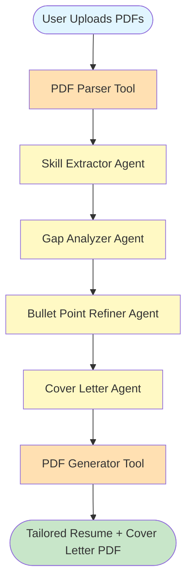
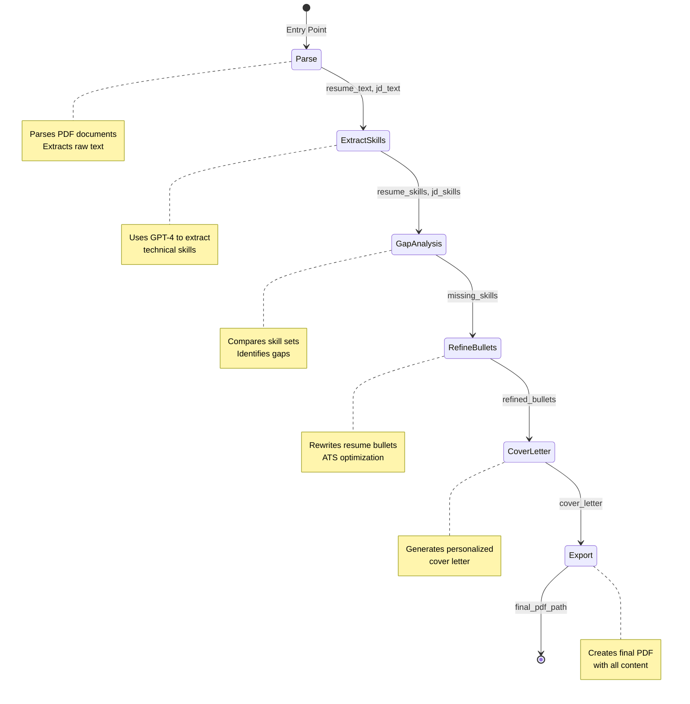
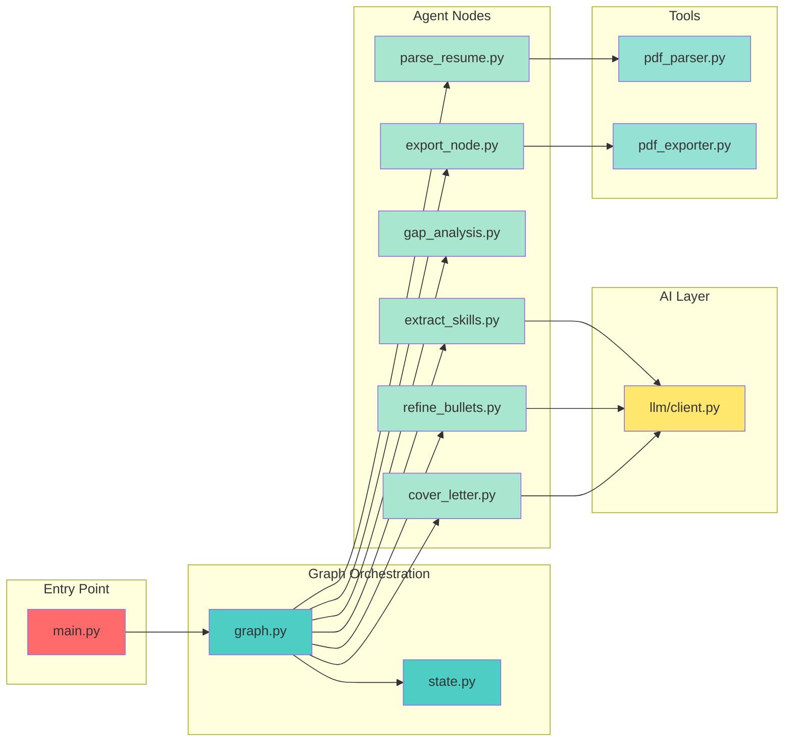
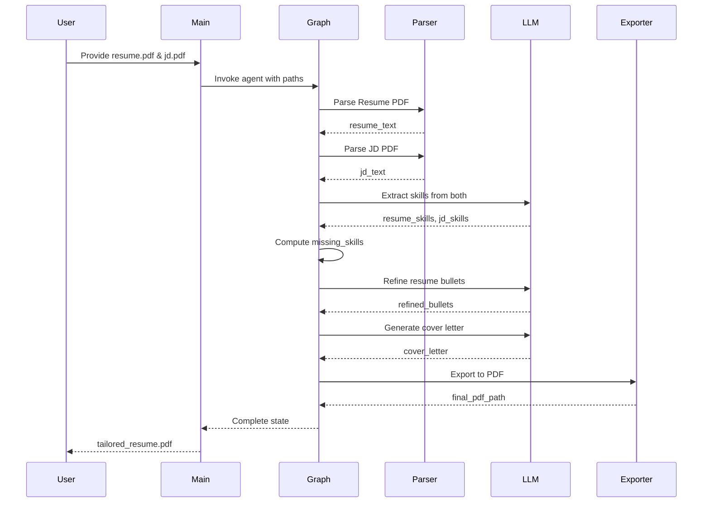
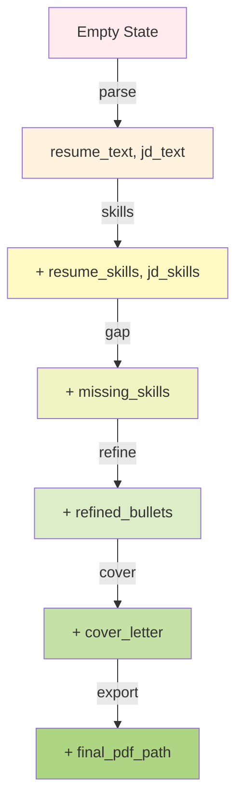
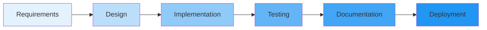

# 🎯 Resume Tailor Agent

<div align="center">


**An intelligent AI-powered agent that automatically tailors your resume and generates personalized cover letters to match any job description.**

[Features](#-features) • [Architecture](#-architecture) • [Installation](#-installation) • [Usage](#-usage) • [How It Works](#-how-it-works)

</div>

---

## 📋 Table of Contents

- [Overview](#-overview)
- [Features](#-features)
- [Architecture](#-architecture)
- [Project Structure](#-project-structure)
- [Installation](#-installation)
- [Usage](#-usage)
- [How It Works](#-how-it-works)
- [Component Details](#-component-details)
- [State Management](#-state-management)
- [Configuration](#-configuration)
- [Examples](#-examples)
- [Contributing](#-contributing)

---

## 🌟 Overview

**Resume Tailor Agent** is an end to end LangGraph powered AI agent that revolutionizes the job application process. By leveraging OpenAI's GPT-4 and intelligent workflow orchestration it analyzes your resume against job descriptions, identifies skill gaps, refines your resume bullets for ATS optimization and generates personalized cover letters all automatically.

### 🎯 Why Use This?

- ⏱️ **Save Time**: Automate the tedious process of tailoring resumes for each job application
- 🎯 **ATS Optimization**: Ensure your resume passes Applicant Tracking Systems
- 🔍 **Skill Gap Analysis**: Identify missing skills and incorporate them strategically
- 📝 **Personalized Content**: Generate custom cover letters that align with job requirements
- 🤖 **AI-Powered**: Leverage GPT-4 for intelligent content generation
- 🔄 **End-to-End Automation**: From PDF input to polished output completely automated

---

## ✨ Features

| Feature | Description |
|---------|-------------|
| 📄 **PDF Upload** | Upload resume and job description PDFs |
| 🔍 **Intelligent Parsing** | Extract text content from PDF documents using PyMuPDF |
| 🧠 **Skill Extraction** | AI-powered extraction of technical skills from both resume and JD |
| 📊 **Gap Analysis** | Identify missing skills by comparing resume vs job requirements |
| ✍️ **Resume Refinement** | Rewrite bullet points to be ATS-friendly and JD-aligned |
| 💌 **Cover Letter Generation** | Create personalized, compelling cover letters |
| 📦 **PDF Export** | Generate professional PDF with tailored resume + cover letter |
| 🔄 **LangGraph Orchestration** | Multi-stage agent workflow with state management |

---

## 🏗️ Architecture

### High-Level System Flow



### LangGraph State Machine



### Detailed Component Architecture



---

## 📁 Project Structure

```
resume_tailor_agent/
│
├── 📄 main.py                      # Application entry point
├── 📄 requirements.txt             # Python dependencies
├── 📄 agent.txt                    # Architecture documentation
├── 📄 README.md                    # This file
│
├── 📂 graph/                       # LangGraph workflow definitions
│   ├── graph.py                    # Graph builder and orchestration
│   ├── state.py                    # State schema definition
│   │
│   └── 📂 nodes/                   # Individual agent nodes
│       ├── parse_resume.py         # PDF parsing node
│       ├── extract_skills.py       # Skill extraction node
│       ├── gap_analysis.py         # Gap analysis node
│       ├── refine_bullets.py       # Resume refinement node
│       ├── cover_letter.py         # Cover letter generation node
│       └── export_node.py          # PDF export node
│
├── 📂 llm/                         # LLM integration layer
│   └── client.py                   # OpenAI client wrapper
│
├── 📂 tools/                       # Utility tools
│   ├── pdf_parser.py               # PDF text extraction
│   └── pdf_exporter.py             # PDF generation
│
└── 📂 utils/                       # Additional utilities (empty)
```

---

## 🚀 Installation

### Prerequisites

- Python 3.8 or higher
- OpenAI API key
- pip package manager

### Step 1: Clone the Repository

```bash
git clone https://github.com/aaryan182/ai_agents_prod_langgraph.git
cd resume_tailor_agent
```

### Step 2: Install Dependencies

```bash
pip install -r requirements.txt
```

### Step 3: Set Up Environment Variables

Create a `.env` file in the root directory:

```bash
OPENAI_API_KEY=your_openai_api_key_here
```

Or export it directly:

```bash
export OPENAI_API_KEY="your_openai_api_key_here"
```

### Dependencies Overview

| Package | Version | Purpose |
|---------|---------|---------|
| `openai` | ≥1.30.0 | OpenAI GPT-4 API integration |
| `langgraph` | ≥0.0.40 | Agent workflow orchestration |
| `PyMuPDF` | ≥1.23.0 | PDF text extraction |
| `fpdf` | ≥1.7.2 | PDF document generation |
| `typing-extensions` | ≥4.9.0 | Enhanced type hints |
| `python-dotenv` | ≥1.0.1 | Environment variable management |

---

## 💻 Usage

### Basic Usage

```python
from graph.graph import build_graph

# Build the agent graph
agent = build_graph()

# Run the agent with your PDFs
result = agent.invoke({
    "resume_path": "path/to/your/resume.pdf",
    "jd_path": "path/to/job_description.pdf"
})

# Get the output
print("PDF Generated:", result["final_pdf_path"])
```

### Running from Command Line

```bash
python main.py
```

### Expected Output

```
PDF Generated: tailored_resume.pdf
```

The output PDF will contain:
1. **Tailored Resume** - Refined bullet points optimized for the job description
2. **Cover Letter** - Personalized cover letter aligned with the role

---

## 🔬 How It Works

### Execution Flow Diagram



### Step-by-Step Process

#### 1️⃣ **PDF Parsing** (`parse_resume_node`)

```python
# Input: PDF file paths
# Output: Extracted text content

state["resume_text"] = parse_pdf(resume_path)
state["jd_text"] = parse_pdf(jd_path)
```

**What happens:**
- Uses PyMuPDF (fitz) to open PDF files
- Iterates through all pages
- Extracts text content
- Stores in state for downstream processing

---

#### 2️⃣ **Skill Extraction** (`extract_skills_node`)

```python
# Input: resume_text, jd_text
# Output: resume_skills[], jd_skills[]

prompt = """
Extract technical skills as a JSON list.

Resume:
{resume_text}

Job Description: 
{jd_text}
"""

skills = call_llm(prompt)
```

**What happens:**
- Constructs a prompt with both resume and JD text
- Sends to GPT-4 for skill extraction
- Parses response to extract skill lists
- Populates `resume_skills` and `jd_skills` in state

---

#### 3️⃣ **Gap Analysis** (`gap_analysis_node`)

```python
# Input: resume_skills[], jd_skills[]
# Output: missing_skills[]

state["missing_skills"] = list(
    set(state["jd_skills"]) - set(state["resume_skills"])
)
```

**What happens:**
- Performs set difference operation
- Identifies skills in JD but not in resume
- Creates actionable list of missing skills
- Pure Python logic—no LLM call needed

---

#### 4️⃣ **Resume Refinement** (`refine_bullets_node`)

```python
# Input: resume_text, missing_skills[]
# Output: refined_bullets

prompt = """
Rewrite resume bullet points to:
- Match job description
- Include missing skills where honest
- Be ATS friendly

Missing Skills:
{missing_skills}

Resume:
{resume_text}
"""

state["refined_bullets"] = call_llm(prompt)
```

**What happens:**
- Creates intelligent prompt with context
- Instructs GPT-4 to rewrite resume bullets
- Incorporates missing skills naturally
- Optimizes for ATS (Applicant Tracking Systems)
- Maintains honesty and authenticity

---

#### 5️⃣ **Cover Letter Generation** (`cover_letter_node`)

```python
# Input: jd_text, refined_bullets
# Output: cover_letter

prompt = """
Write a personalized cover letter based on:

Job Description:
{jd_text}

Refined Resume:
{refined_bullets}
"""

state["cover_letter"] = call_llm(prompt)
```

**What happens:**
- Uses refined resume and JD as context
- Generates personalized, compelling cover letter
- Aligns content with job requirements
- Maintains professional tone

---

#### 6️⃣ **PDF Export** (`export_node`)

```python
# Input: refined_bullets, cover_letter
# Output: final_pdf_path

content = (
    "TAILORED RESUME\n\n"
    + state["refined_bullets"]
    + "\n\nCOVER LETTER\n\n"
    + state["cover_letter"]
)

state["final_pdf_path"] = export_pdf(content, "tailored_resume.pdf")
```

**What happens:**
- Combines resume and cover letter
- Creates formatted PDF using FPDF
- Saves to `tailored_resume.pdf`
- Returns file path in state

---

## 🧩 Component Details

### 1. Graph Orchestration (`graph/graph.py`)

The brain of the operation—defines the workflow and connections between nodes.

```python
def build_graph():
    g = StateGraph(ResumeState)
    
    # Add all processing nodes
    g.add_node("parse", parse_resume_node)
    g.add_node("skills", extract_skills_node)
    g.add_node("gap", gap_analysis_node)
    g.add_node("refine", refine_bullets_node)
    g.add_node("cover", cover_letter_node)
    g.add_node("export", export_node)
    
    # Define entry point
    g.set_entry_point("parse")
    
    # Create linear workflow
    g.add_edge("parse", "skills")
    g.add_edge("skills", "gap")
    g.add_edge("gap", "refine")
    g.add_edge("refine", "cover")
    g.add_edge("cover", "export")
    g.add_edge("export", END)
    
    return g.compile()
```

**Key Features:**
- Uses LangGraph's `StateGraph` for orchestration
- Linear workflow with clear dependencies
- Type-safe state management
- Compiled graph for efficient execution

---

### 2. State Schema (`graph/state.py`)

Defines the data structure passed between nodes.

```python
class ResumeState(TypedDict):
    resume_text: str              # Extracted resume text
    jd_text: str                  # Extracted job description text
    resume_skills: List[str]      # Skills found in resume
    jd_skills: List[str]          # Skills required in JD
    missing_skills: List[str]     # Gap between resume and JD
    refined_bullets: str          # Improved resume content
    cover_letter: str             # Generated cover letter
    final_pdf_path: str           # Output file path
```

**Benefits:**
- Type safety with `TypedDict`
- Clear data contracts between nodes
- Easy to extend with new fields
- Self-documenting code

---

### 3. LLM Client (`llm/client.py`)

Wrapper for OpenAI API interactions.

```python
def call_llm(prompt, model="gpt-4.1"):
    res = client.chat.completions.create(
        model=model,
        messages=[{"role": "user", "content": prompt}]
    )
    return res.choices[0].message.content
```

**Features:**
- Simple, reusable interface
- Configurable model selection
- Uses OpenAI's latest SDK
- Easy to extend with parameters (temperature, max_tokens, etc.)

---

### 4. PDF Tools

#### Parser (`tools/pdf_parser.py`)

```python
def parse_pdf(path: str) -> str:
    doc = fitz.open(path)
    text = ""
    for page in doc:
        text += page.get_text()
    return text
```

**Capabilities:**
- Handles multi-page PDFs
- Extracts clean text
- Works with various PDF formats
- Fast and reliable (PyMuPDF)

#### Exporter (`tools/pdf_exporter.py`)

```python
def export_pdf(content: str, path: str):
    pdf = FPDF()
    pdf.add_page()
    pdf.set_font("Arial", size=12)
    for line in content.split("\n"):
        pdf.multi_cell(0, 8, line)
    pdf.output(path)
    return path
```

**Features:**
- Clean, professional formatting
- Multi-cell support for long text
- Automatic page breaks
- Customizable fonts and styling

---

## 📊 State Management

### State Flow Diagram



### State Evolution Example

```python
# Initial State (passed by user)
{
    "resume_path": "resume.pdf",
    "jd_path": "job_description.pdf"
}

# After Parse Node
{
    "resume_text": "John Doe\nSoftware Engineer...",
    "jd_text": "We are looking for a Senior Developer..."
}

# After Extract Skills Node
{
    ...,
    "resume_skills": ["Python", "JavaScript", "SQL"],
    "jd_skills": ["Python", "JavaScript", "SQL", "Docker", "Kubernetes"]
}

# After Gap Analysis Node
{
    ...,
    "missing_skills": ["Docker", "Kubernetes"]
}

# After Refine Bullets Node
{
    ...,
    "refined_bullets": "• Developed scalable applications using Python...\n• Experience with containerization tools..."
}

# After Cover Letter Node
{
    ...,
    "cover_letter": "Dear Hiring Manager,\n\nI am excited to apply..."
}

# Final State (after Export Node)
{
    ...,
    "final_pdf_path": "tailored_resume.pdf"
}
```

---

## ⚙️ Configuration

### Environment Variables

| Variable | Description | Required | Default |
|----------|-------------|----------|---------|
| `OPENAI_API_KEY` | OpenAI API authentication key | ✅ Yes | None |

### Model Configuration

You can customize the LLM model in `llm/client.py`:

```python
def call_llm(prompt, model="gpt-4.1"):  # Change model here
    # ...
```

**Available Models:**
- `gpt-4` - Most capable, slower
- `gpt-4-turbo` - Fast and capable
- `gpt-3.5-turbo` - Faster, less capable
- `gpt-4o` - Optimized version

---

## 📝 Examples

### Example 1: Basic Usage

```python
from graph.graph import build_graph

agent = build_graph()

result = agent.invoke({
    "resume_path": "my_resume.pdf",
    "jd_path": "job_posting.pdf"
})

print(f"Success! Generated: {result['final_pdf_path']}")
print(f"Missing skills identified: {result['missing_skills']}")
```

### Example 2: Accessing Intermediate Results

```python
agent = build_graph()

result = agent.invoke({
    "resume_path": "resume.pdf",
    "jd_path": "jd.pdf"
})

# Access all state values
print("Resume Skills:", result["resume_skills"])
print("JD Skills:", result["jd_skills"])
print("Missing Skills:", result["missing_skills"])
print("\n--- Refined Resume ---")
print(result["refined_bullets"])
print("\n--- Cover Letter ---")
print(result["cover_letter"])
```

### Example 3: Custom Processing

```python
from graph.graph import build_graph
from tools.pdf_parser import parse_pdf

# Pre-process resume
resume_text = parse_pdf("resume.pdf")
print(f"Resume has {len(resume_text)} characters")

# Run agent
agent = build_graph()
result = agent.invoke({
    "resume_path": "resume.pdf",
    "jd_path": "jd.pdf"
})

# Post-process results
if len(result["missing_skills"]) > 5:
    print("⚠️ Warning: Many missing skills detected!")
    print("Consider additional training in:", result["missing_skills"])
```

---

## 🎨 Advanced Features

### Extending the Graph

You can add custom nodes to the workflow:

```python
# Add a new node
def custom_formatting_node(state):
    # Your custom logic
    state["formatted_content"] = format_content(state["refined_bullets"])
    return state

# Modify graph builder
def build_graph():
    g = StateGraph(ResumeState)
    
    # ... existing nodes ...
    g.add_node("format", custom_formatting_node)
    
    # Insert into workflow
    g.add_edge("refine", "format")
    g.add_edge("format", "cover")
    
    return g.compile()
```

### Custom Prompts

Modify prompts in individual node files for different behavior:

```python
# In refine_bullets.py
prompt = f"""
Rewrite resume bullet points to:
- Use STAR method (Situation, Task, Action, Result)
- Include quantifiable metrics
- Match job description keywords
- Be ATS friendly
- Highlight leadership and impact

Missing Skills: {state['missing_skills']}
Resume: {state['resume_text']}
"""
```

---

## 🔍 Troubleshooting

### Common Issues

#### 1. OpenAI API Key Error

```
Error: OpenAI API key not found
```

**Solution:** Set your API key in environment variables:
```bash
export OPENAI_API_KEY="sk-..."
```

#### 2. PDF Parsing Issues

```
Error: Could not open PDF file
```

**Solution:** Ensure PDF path is correct and file is not corrupted:
```python
import os
print(os.path.exists("resume.pdf"))  # Should return True
```

#### 3. Model Not Found

```
Error: Model 'gpt-4.1' not found
```

**Solution:** Use a valid model name in `llm/client.py`:
```python
def call_llm(prompt, model="gpt-4"):  # Use gpt-4 instead
```

---

## 🧪 Testing

### Manual Testing

```python
# Test individual components
from tools.pdf_parser import parse_pdf
from tools.pdf_exporter import export_pdf

# Test parser
text = parse_pdf("test.pdf")
print(f"Extracted {len(text)} characters")

# Test exporter
export_pdf("Test content", "test_output.pdf")
print("Export successful")
```

### Testing Individual Nodes

```python
from graph.nodes.gap_analysis import gap_analysis_node

# Mock state
state = {
    "resume_skills": ["Python", "SQL"],
    "jd_skills": ["Python", "SQL", "Docker"]
}

result = gap_analysis_node(state)
print(result["missing_skills"])  # ["Docker"]
```

---

## 🛠️ Development

### Project Development Workflow



### Adding New Features

1. **Define State Changes**: Update `graph/state.py` if new fields needed
2. **Create Node**: Add new node in `graph/nodes/`
3. **Update Graph**: Modify `graph/graph.py` to include new node
4. **Test**: Verify integration with existing workflow
5. **Document**: Update README with new feature

---

## 📈 Performance

### Typical Execution Times

| Node | Average Time | Notes |
|------|--------------|-------|
| Parse | 1-2s | Depends on PDF size |
| Extract Skills | 3-5s | LLM call |
| Gap Analysis | <0.1s | Pure Python |
| Refine Bullets | 5-10s | LLM call, longer content |
| Cover Letter | 5-8s | LLM call |
| Export | 1-2s | PDF generation |
| **Total** | **~15-30s** | End-to-end |

### Optimization Tips

1. **Use faster models** for non-critical tasks (e.g., `gpt-3.5-turbo`)
2. **Parallel processing** for independent nodes (future enhancement)
3. **Cache results** for repeated runs with same inputs
4. **Batch processing** multiple resumes

---

## 🔒 Security & Privacy

### Best Practices

- ✅ Store API keys in environment variables, never in code
- ✅ Don't commit `.env` files to version control
- ✅ Be mindful of sensitive information in resumes
- ✅ Consider data retention policies for uploaded PDFs
- ✅ Use secure API key storage in production

### Data Flow

```
Your Machine → OpenAI API → Your Machine
     ↓                            ↓
   PDFs                    Tailored PDF
```

**Important:** Your data is processed by OpenAI's API. Review [OpenAI's privacy policy](https://openai.com/privacy) for details.

---

## 🚧 Future Enhancements

- [ ] Web UI for easier interaction
- [ ] Support for DOCX files (Word documents)
- [ ] Multiple resume templates
- [ ] A/B testing for different resume versions
- [ ] Integration with job boards (LinkedIn, Indeed)
- [ ] Skill recommendation engine
- [ ] Interview preparation tips based on JD
- [ ] Salary negotiation insights
- [ ] Company research integration
- [ ] Email draft generation for applications

---

## 🤝 Contributing

Contributions are welcome! Here's how you can help:

1. **Fork** the repository
2. **Create** a feature branch (`git checkout -b feature/AmazingFeature`)
3. **Commit** your changes (`git commit -m 'Add some AmazingFeature'`)
4. **Push** to the branch (`git push origin feature/AmazingFeature`)
5. **Open** a Pull Request

### Contribution Guidelines

- Write clear commit messages
- Add tests for new features
- Update documentation
- Follow existing code style
- Be respectful and constructive

---


## 🙏 Acknowledgments

- **LangGraph** for the excellent agent orchestration framework
- **OpenAI** for GPT-4 and powerful language models
- **PyMuPDF** for reliable PDF parsing
- **FPDF** for simple PDF generation
- The open-source community for inspiration and support

---


## 🌟 Star History

If you find this project useful, please consider giving it a ⭐ on GitHub!

---

<div align="center">

**[⬆ Back to Top](#-resume-tailor-agent)**

</div>
